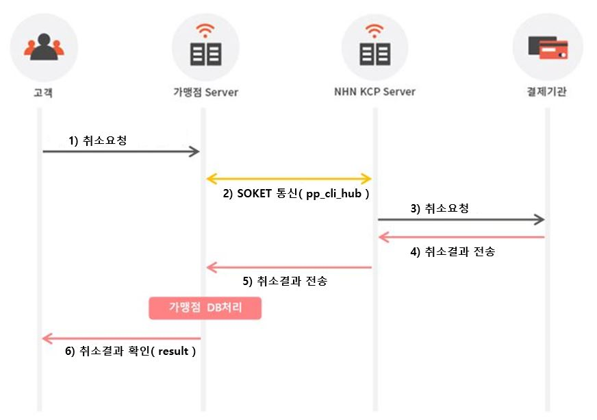

# 머리말

**문서개요**

* 가맹점에서 구현해야 하는 API 명세 가이드
* 서비스 설명 및 NHN KCP 권고 사항 설명
* 각 샘플 페이지 해당 역할 및 파라미터 상세 안내

**독자**

* 이 문서의 독자는 NHN KCP PG결제를 연동하는 가맹점 사이트 개발자입니다.

**문의처**

이 문서의 내용에 오류가 있거나 내용과 관련한 의문 사항이 있으시면 아래 연락처로 문의 바랍니다.

* NHN KCP 기술지원팀 : 1544-8661 혹은 support@kcp.co.kr

## 취소처리 흐름도

## 연동 전 준비사항

### 1.공통 안내 및 권장사항

* KCP 인코딩 방식은 **EUC-KR** 형식을 사용하며, 이에 따른 리턴 값도 **EUC-KR**로 제공합니다.
* 결제로그\(log\)는 기본적으로 관리를 권장합니다. \(※ 오류 거래 건에 대한 추적이 필요할 수 있음\)
* 통신방식은 샘플소스 기준으로 bin\pp\_cli \(실행파일\)를 통해 가맹점 서버와 소켓통신 합니다.\( JSP의 경우 lib\jPpcliE.jar 파일 \)
* 방화벽은 KCP와 결제 통신을 위해 TCP SOCKET을 사용합니다.

**※ 방화벽 설정 정보**

<table>
  <thead>
    <tr>
      <th style="text-align:left">&#xC5F0;&#xACB0;&#xB300;&#xC0C1; PORT</th>
      <th style="text-align:left"><b>8090</b>
      </th>
    </tr>
  </thead>
  <tbody>
    <tr>
      <td style="text-align:left">&#xC5F0;&#xACB0;&#xB300;&#xC0C1; &#xB3C4;&#xBA54;&#xC778;</td>
      <td style="text-align:left">
        
paygw.kcp.co.kr (&#xC2E4; &#xACB0;&#xC81C;)

        
testpaygw.kcp.co.kr (&#xD14C;&#xC2A4;&#xD2B8; &#xACB0;&#xC81C;)

      </td>
    </tr>
  </tbody>
</table>

* **KCP 결제 모듈에는 DB 연동 작업을 위한 기능이 포함되어 있지 않고, DB연동을 위한 지불 결과 데이터만 제공 되므로, DB처리에 관한 부분은 일체 가맹점에서 관리가 필요합니다.**
* 결과 요청 및 처리에 관한 변수처리는 기관의 정책이나 신규 서비스 출시 등에 따라 변경이 될 수 있으니 연동 메뉴얼을 업데이트하여 관리하는 것을 권장합니다.

  **\*\*위 사항을 지키지 않아 발생하는 문제에 대하여 KCP는 책임을 지지 않습니다. \*\***

### 2.API 규격 안내 및 특수문자

해당 항목에서는 결제 시스템을 구축하기 위한 파라미터 소개 및 규격 안내 페이지입니다. 제공해 드리는 샘플소스와 함께 해당 파라미터를 참고하시어 연동하시기 바랍니다.

**데이터 타입**

| Column | Type | Description |
| :--- | :--- | :--- |
| 1 | Number | 숫자형 Integer : \(0~9\) |
| 2 | String | 문자형 String : Alpha numeric \(A-Z; 0-9; UTF-8 characters\) |
| 3 | Etc | 기타 Etc |

**사용불가 특수문자**

| 콤마 | 엠퍼센트 | 세미콜론 | 뉴 라인 | 역 슬래쉬 | 파이프 라인 | 작은 따옴표 | 큰 따옴표 | 부등호 |
| :---: | :---: | :---: | :---: | :---: | :---: | :---: | :---: | :---: |
| **,** | & | ; | \n | \ | \| | ' | " | &lt; |

※ 스크립트 언어 불가 ex\) &lt;script&gt;. eval;\(\(.\*\)\)

※ \u0000 : unicode null

요청 페이지에서 데이터를 입력할 때, 위와 같은 특수 문자를 입력할 경우 오류가 발생할 수 있습니다. 위 특수 문자 목록을 반드시 참고하여, 데이터를 입력할 때에 반드시 체크해 주시기 바랍니다.

### 3.보안지침서

