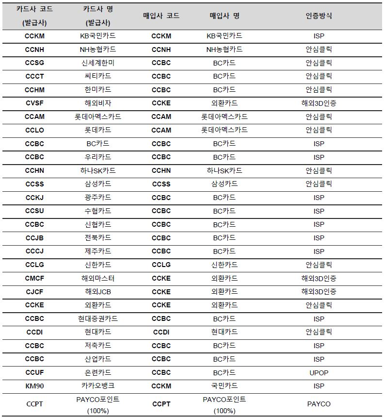
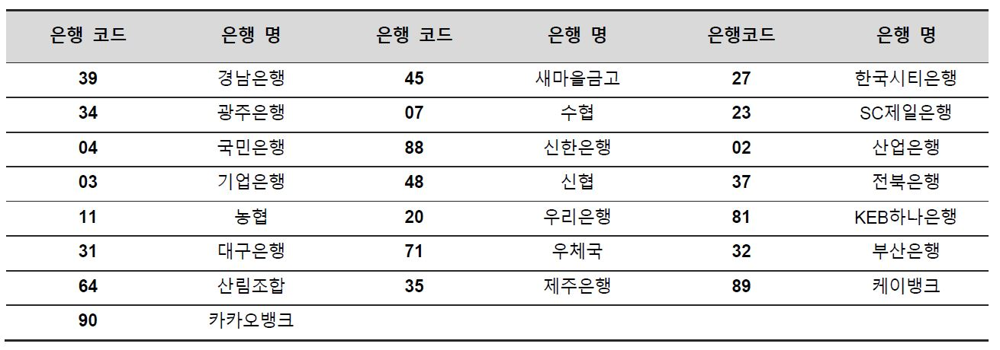
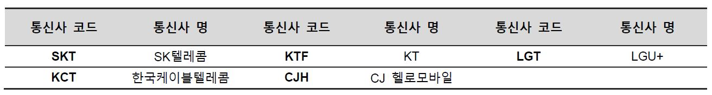
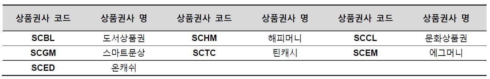
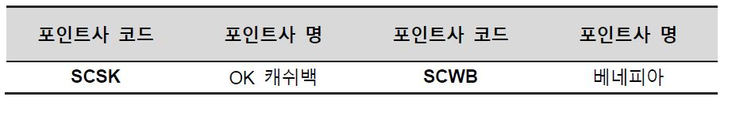

# 참고사항

## 코드표

### 1.승인 및 매입 카드사 코드 표

※ 결제창 호출 시 구분하는 used\_card 의 카드코드와 결제 승인 완료 후 리턴 되는 발급 사 코드\(card\_cd\), 매입사 코드\(acqu\_cd\)는 다른 부분임을 유의

※ 카카오뱅크 카드로 결제 시 ‘card\_cd = CCKM, card\_name = 국민카드’로 리턴 되지만, isp\_issuer\_cd 와, isp\_issuer\_nm 파라미터로 결제 카드를 구분할 수 있습니다. \( isp\_issuer\_cd=KM90, isp\_issuer\_nm=카카오뱅크\)

### 2.은행코드표

![\[&#xC778;&#xC218; &#xD569;&#xBCD1;&#xB41C; &#xAD6C; &#xC740;&#xD589; &#xCF54;&#xB4DC; &#xD45C;\]](.gitbook/assets/bank_cd1.jpg)

![\[&#xC99D;&#xAD8C;&#xC0AC; &#xC740;&#xD589;&#xCF54;&#xB4DC;\]](.gitbook/assets/bank_cd2.jpg)

※ 테스트코드\(T0000\)로 계좌이체 테스트 시 금융결제원과 협의된 은행 코드로 리턴 됩니다. 

※ 결과 처리 시 리턴 받는 은행코드는 일반은행의 경우는 BK04로 4자리를 맞추며 증권사의 경우 B209로 맞춰집니다.

![\[&#xAC00;&#xC0C1;&#xACC4;&#xC88C; &#xCC44;&#xBC88; &#xC2DC; &#xC0AC;&#xC6A9; &#xAC00;&#xB2A5;&#xD55C; &#xC740;&#xD589;&#xCF54;&#xB4DC;\]](.gitbook/assets/bank_cd3.jpg)

### 3.통신사 코드

### 4.상품권사 코드

### 5.포인트사 코드

