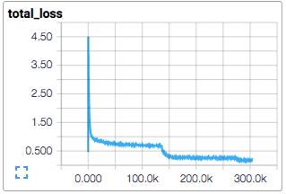
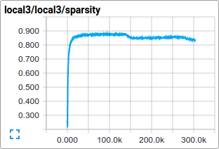
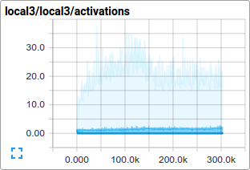
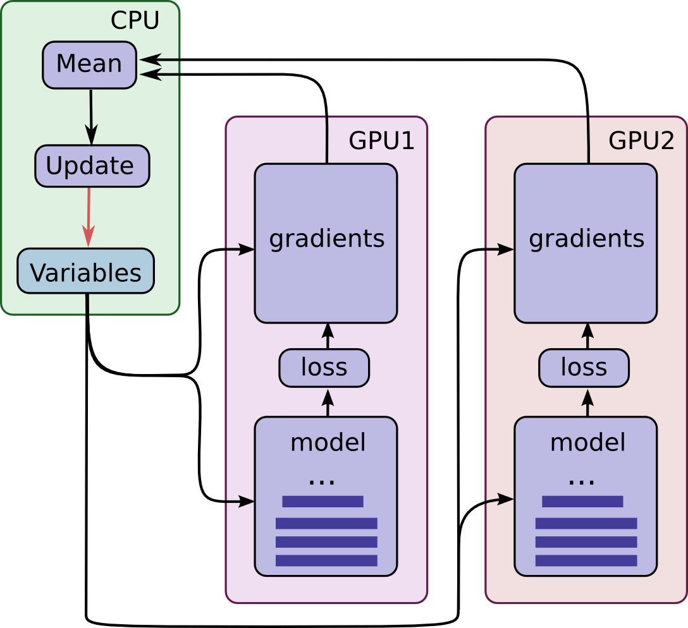

# 콘볼루션 뉴럴 네트워크

> **NOTE:** 이 튜토리얼은 텐서플로우에 _능숙한_ 사용자를 대상으로 하며, 기계학습에 대한 전문 지식과 경험을 갖고 있다는 전제로 쓰였습니다.

## 개요

CIFAR-10 분류는 기계학습에서 흔히 사용되는 벤치마크 문제입니다. 이 분류 문제는 RGB 32x32 픽셀 이미지를 다음의 10개 카테고리로 분류하는 것이 목표입니다 : `비행기, 자동차, 새, 고양이, 사슴, 개, 개구리, 말, 배, 트럭.`

더 자세한 설명을 원하신다면 [CIFAR-10 페이지](http://www.cs.toronto.edu/~kriz/cifar.html)와 Alex Krizhevsky의 [기술 보고서](http://www.cs.toronto.edu/~kriz/learning-features-2009-TR.pdf)를 참조하세요.

### 목표

이 튜토리얼의 목표는 이미지를 인식하는 상대적으로 작은 \[컨볼루셔널 뉴럴 네트워크\]를 만드는 것입니다. 이 과정에서, 튜토리얼에서는

1. 네트워크 구조와 학습 및 평가의 표준적인 구성에 주목하고,
2. 더 크고 복잡한 모델에 대한 예제를 제공합니다.

CIFAR-10 분류가 선택된 이유는 더 큰 모델을 다루는 데에 필요한 텐서플로우의 많은 기능들을 연습하기에 충분히 복잡하기 때문입니다. 그와 동시에, 충분히 작은 모델이기 때문에 학습이 빨라 새로운 아이디어를 적용해보거나 새로운 테크닉을 실험해보기에 적합하기 때문입니다.

### 튜토리얼의 주안점

CIFAR-10 튜토리얼은 텐서플로우로 더 크고 복잡한 모델을 디자인하기 위한 몇몇의 주요 구성들을 설명합니다.

* 주요 수학적 요소 : [Convolution](../../index-4/index-1/nn.md#conv2d) \([wiki](https://en.wikipedia.org/wiki/Convolution)\), [rectified linear activations](../../index-4/index-1/nn.md#relu) \(\[wiki\]\( [https://en.wikipedia.org/wiki/Rectifier\_\(neural\_networks](https://en.wikipedia.org/wiki/Rectifier_%28neural_networks)\)\)\), [Max Pooling](../../index-4/index-1/nn.md#max_pool) \([wiki](https://en.wikipedia.org/wiki/Convolutional_neural_network#Pooling_layer)\) and [local response normalization](../../index-4/index-1/nn.md#local_response_normalization) \(Chapter 3.3 in [AlexNet paper](http://papers.nips.cc/paper/4824-imagenet-classification-with-deep-convolutional-neural-networks.pdf)\).
* 활성화\(Activations\)와 경사\(gradients\)의 손실\(loss\) 및 분포와 입력된 이미지를 포함하는 학습 중인 네트워크의 활동 [시각화](../../index-3/index-2.md)
* 학습된 변수의 [이동 평균\(moving average\)](../../index-4/index-1/train.md#ExponentialMovingAverage)을 계산하는 방법과 평가를 할 때 예측 성능을 향상시키기 위하여 이 평균들을 이용하는 방법
* 체계적으로 시간에 따라 감소하는 [학습 비율\(learning rate\) 스케쥴](../../index-4/index-1/train.md#exponential_decay)의 구현
* 디스크 지연과 비싼 이미지 전처리를 모델로부터 분리하기 위한 입력 데이터 [큐](../../index-4/index-1/io_ops.md#shuffle_batch)의 선인출\(prefetching\)

또한 저희는 모델의 [다중-GPU 버전](index.md#training-a-model-using-multiple-gpu-cards)을 제공합니다. 이 모델은 다음과 같은 사항들을 설명합니다:

* 다수의 GPU 카드에서 병렬로 훈련할 모델을 구성하기
* 다수의 GPU 간에 변수들을 공유하고 업데이트하기

우리는 이 튜토리얼이 TensorFlow로 영상\(vision\) 작업에 필요한 큰 CNN을 구축하기 위한 시발점이 되었으면 합니다.

### 모델 구조

CIFAR-10 튜토리얼의 모델은 컨볼루션과 비선형이 교차되어있는 다중 레이어 구조로 구성되어 있습니다. 이 레이어들 뒤로는 Softmax 분류기로 이어지는 Fully connected layer가 있습니다. 상위 몇몇 레이어를 제외하고, 이 모델은 [Alex Krizhevsky](https://code.google.com/p/cuda-convnet/)가 만든 모델을 따르고 있습니다.

이 모델은 GPU에서 몇시간의 학습을 거친 후 최대 86%의 정확도를 달성하였습니다. 좀더 자세한 사항은 [아래](index.md#evaluating-a-model)와 코드를 참조하세요. 이 모델은 1,068,298개의 학습 가능한 매개변수로 구성되어 있으며, 단일 이미지를 추론하는 데에 19.5M의 곱셉-덧셈 연산이 필요합니다.

## 코드 구성

이 튜토리얼의 코드는 [`tensorflow/models/image/cifar10/`](https://www.tensorflow.org/code/tensorflow/models/image/cifar10/) 에 있습니다.

| 파일 | 목적 |
| :--- | :--- |
| [`cifar10_input.py`](https://www.tensorflow.org/code/tensorflow/models/image/cifar10/cifar10_input.py) | CIFAR-10 바이너리 파일 포맷을 읽어들입니다. |
| [`cifar10.py`](https://www.tensorflow.org/code/tensorflow/models/image/cifar10/cifar10.py) | CIFAR-10 모델을 만듭니다. |
| [`cifar10_train.py`](https://www.tensorflow.org/code/tensorflow/models/image/cifar10/cifar10_train.py) | CIFAR-10 모델을 CPU 혹은 GPU로 학습합니다. |
| [`cifar10_multi_gpu_train.py`](https://www.tensorflow.org/code/tensorflow/models/image/cifar10/cifar10_multi_gpu_train.py) | CIFAR-10 모델을 다중 GPU로 학습합니다. |
| [`cifar10_eval.py`](https://www.tensorflow.org/code/tensorflow/models/image/cifar10/cifar10_eval.py) | CIFAR-10 모델의 예측 성능을 평가합니다. |

## CIFAR-10 모델

CIFAR-10 네트워크는 주로 ['cifar10.py'](https://www.tensorflow.org/code/tensorflow/models/image/cifar10/cifar10.py)에 들어있습니다. 전체 훈련 그래프는 약 765개의 연산을 포함합니다. 우리는 아래의 모듈들로 그래프를 구성하는 것이 가장 재사용성이 높은 코드를 만드는 방법임을 알게 되었습니다:

1. [**모델 입력:**](index.md#model-inputs) 'inputs\(\)' 와 'distorted\_inputs\(\)'는 각각 평가와 훈련을 위한 CIFAR 이미지를 읽고 전처리를 하는 연산들을 추가합니다.
2. [**모델 예측:**](index.md#model-prediction) 'inference\(\)'는 추론을 수행하는 연산들을 추가합니다. 예\) 제공된 이미지에 대한 분류
3. [**모델 훈련:**](index.md#model-training) 'loss\(\)'와 'train\(\)'은 손실\(loss\)과 경사\(gradients\), 변수 업데이트와 시각화 요약을 계산하는 연산들을 추가합니다.

### 모델 입력

모델의 입력 부분은 CIFAR-10 바이너리 데이터 파일로부터 이미지를 읽는 'inputs\(\)'와 'distorted\_inputs\(\)' 로 구성되어 있습니다. 이 데이터 파일들은 고정 바이트 길이 레코드를 담고있어, 우리는 [`tf.FixedLengthRecordReader`](../../index-4/index-1/io_ops.md#FixedLengthRecordReader)를 사용합니다. 'Reader' 클래스가 어떻게 작동하는지 더 알고 싶으시다면 [Reading Data](../../index-3/index-4.md#reading-from-files)를 참조하세요.

이미지들은 아래의 과정을 통하여 처리됩니다.

* 이미지는 24 x 24 픽셀로 잘라냅니다.

  훈련을 위하여 [무작위로](../../index-4/index-1/constant_op.md#random_crop) 잘라내거나 혹은 평가를 위하여 중심만 잘라냅니다.

* 동적 범위 내에 모델이 둔감해지도록 [대략적인 화이트닝](../../index-4/index-1/image.md#per_image_whitening)을 합니다

훈련을 위하여 추가적으로 일련의 무작위 왜곡을 적용하여 인공적으로 데이터 셋의 크기를 키웁니다:

* 이미지를 좌에서 우로 [무작위로 뒤집기](../../index-4/index-1/image.md#random_flip_left_right)
* [이미지 밝기](../../index-4/index-1/image.md#random_brightness)를 무작위로 왜곡하기
* [이미지 대비](../../index-4/index-1/image.md#random_contrast)를 무작위로 왜곡하기

가능한 왜곡의 목록은 [Images](../../index-4/index-1/image.md) 페이지를 참조하세요. 또한 [`image_summary`](../../index-4/index-1/train.md#image_summary)를 이미지에 붙여 [TensorBoard](../../index-3/index-2.md)에서 시각화 할 수 있도록 하였습니다. 이는 입력이 제대로 만들어 졌는지 확인하기 위한 좋은 연습이 될 것 입니다.


디스크에서 이미지를 읽고 왜곡을 하는 것은 적지 않은 양의 처리 시간이 필요할 수 있습니다. 이러한 작업이 훈련을 늦추는 것을 방지하기 위해, 우리는 이 작업을 16개의 독립된 스레드로 나누어 실행시킵니다. 이 스레드는 TensorFlow [큐](../../index-4/index-1/io_ops.md#shuffle_batch)를 계속해서 채웁니다.

### 모델 예측

모델의 예측 부분은 'inference\(\)' 함수로 구성되어 있습니다. 이 함수는 예측의 _로짓\(logit\)_들을 계산하는 연산을 추가합니다. 모델의 해당 부분은 다음과 같이 구성되어 있습니다:

| 레이어 명 | 설명 |
| :--- | :--- |
| `conv1` | [컨볼루션\(convolution\)](../../index-4/index-1/nn.md#conv2d) 과 [정류된 선형\(rectified linear\)](../../index-4/index-1/nn.md#relu) 활성화 레이어. |
| `pool1` | [최대 풀링\(max pooling\)](../../index-4/index-1/nn.md#max_pool) 레이어. |
| `norm1` | [지역 반응 정규화\(local response normalization\)](../../index-4/index-1/nn.md#local_response_normalization) 레이어. |
| `conv2` | [컨볼루션\(convolution\)](../../index-4/index-1/nn.md#conv2d) 과 [정류된 선형\(rectified linear\)](../../index-4/index-1/nn.md#relu) 활성화 레이어. |
| `norm2` | [지역 반응 정규화\(local response normalization\)](../../index-4/index-1/nn.md#local_response_normalization). |
| `pool2` | [최대 풀링\(max pooling\)](../../index-4/index-1/nn.md#max_pool) 레이어. |
| `local3` | [정류된 선형 활성화가 포함된 완전 연결 레이어\(fully connected layer with rectified linear activation\)](../../index-4/index-1/nn.md). |
| `local4` | [정류된 선형 활성화가 포함된 완전 연결 레이어\(fully connected layer with rectified linear activation\)](../../index-4/index-1/nn.md). |
| `softmax_linear` | 로짓\(logit\)들을 생산하는 선형 변환\(linear transformation\) |

아래의 그래프는 TensorBoard를 통해 생성된 추론\(inference\) 연산을 설명합니다.


> **연습**: '추론\(inference\)'의 출력값은 정규화되지 않은 로짓\(logit\)입니다. [`tf.nn.softmax()`](../../index-4/index-1/nn.md#softmax)을 사용하여 정규화된 예측값을 리턴하도록 네트워크 구조를 수정해보세요.

'inputs\(\)'와 'inference\(\)' 함수는 모델을 평가하는데 필요한 모든 컴포넌트들을 제공합니다. 이제 우리는 모델을 훈련하는 작업을 구축하는 것으로 초점을 옮겨봅시다.

> **연습:** 'inference\(\)'의 모델 구조는 [cuda-convnet](https://code.google.com/p/cuda-convnet/) 에서 명시하는 CIFAR-10 모델과 조금 다릅니다. 특히, Alex의 원본 모델의 최상위 레이어는 완전 연결\(fully connected\)이 아니라 국소 연결\(locally connected\) 되어있습니다. 최상위 레이어에서 국소 연결\(locally connected\) 구조를 정확하게 재현하도록 구조를 수정해보세요.

### 모델 훈련

N-way 분류를 수행하는 네트워크를 훈련시키는 일반적인 방법은 _소프트맥스 회귀\(Softmax regression\)_로 알려진 [다항 로지스틱 회귀\(multinomial logistic regression\)](https://en.wikipedia.org/wiki/Multinomial_logistic_regression)입니다. 소프트맥스 회귀\(Softmax regression\)는 네트워크의 출력값에 [softmax](../../index-4/index-1/nn.md#softmax) 비선형성을 적용하고, 정규화된 예측값과 [1-핫 인코딩\(1-hot encoding\)](../../index-4/index-1/sparse_ops.md#sparse_to_dense)된 라벨 사시의 [크로스 엔트로피\(cross-entropy\)](../../index-4/index-1/nn.md#softmax_cross_entropy_with_logits)를 계산합니다. 균일화\(regularization\)를 위하여, 우리는 모든 학습된 변수에 대하여 일반적인 [가중치 감소\(weight decay\)](../../index-4/index-1/nn.md#l2_loss) 손실을 적용합니다. 모델의 목적함수는 크로스 엔트로피 손실의 합과 'loss\(\)' 함수에 의해 리턴되는, 모든 가중치 감소\(weight decay\) 텀의 합입니다.

우리는 TensorBoard의 [`scalar_summary`](../../index-4/index-1/train.md#scalar_summary)를 사용하여 이를 시각화 하였습니다.



우리는 표준적인 [경사 강하\(gradient descent\)](https://en.wikipedia.org/wiki/Gradient_descent) 알고리즘 \(다른 방법을 보려면 [Training](../../index-4/index-1/train.md)을 참조\)을 사용하여 모델을 훈련합니다. 시간에 따라 [급격하게 감소\(exponentially decays\)](../../index-4/index-1/train.md#exponential_decay)하는 학습 비율\(learning rate\)을 사용하였습니다.


'train\(\)' 함수는 경사\(gradient\)를 계산하고 학습된 변수를 업데이트함으로써 목표를 최소화 하는데에 필요한 기능을 추가합니다 \( 자세한 사항은 [`GradientDescentOptimizer`](../../index-4/index-1/train.md#GradientDescentOptimizer) 참조\). 이 함수는 하나의 이미지 배치\(batch\)에 대하여 모델을 훈련하고 업데이트 하는데 필요한 모든 연산을 실행하는 기능을 리턴해줍니다.

## 모델 실행 및 훈련 해보기

모델을 만들었으니, 이제 이 모델을 실행해보고 `cifar10_train.py` 스크립트를 사용하여 훈련 작업을 실행해봅시다.

```text
python cifar10_train.py
```

> **참고:** 여러분이 CIFAR-10 튜토리얼에서 처음 어떤 타겟을 실행하면, CIFAR-10 데이터셋이 자동으로 다운로드 됩니다. 데이터셋은 160MB 이하 입니다. 아마 그동안 당신은 커피 한 잔이 떠오를 지도 모릅니다.

출력을 보아야 합니다:

```text
Filling queue with 20000 CIFAR images before starting to train. This will take a few minutes.
2015-11-04 11:45:45.927302: step 0, loss = 4.68 (2.0 examples/sec; 64.221 sec/batch)
2015-11-04 11:45:49.133065: step 10, loss = 4.66 (533.8 examples/sec; 0.240 sec/batch)
2015-11-04 11:45:51.397710: step 20, loss = 4.64 (597.4 examples/sec; 0.214 sec/batch)
2015-11-04 11:45:54.446850: step 30, loss = 4.62 (391.0 examples/sec; 0.327 sec/batch)
2015-11-04 11:45:57.152676: step 40, loss = 4.61 (430.2 examples/sec; 0.298 sec/batch)
2015-11-04 11:46:00.437717: step 50, loss = 4.59 (406.4 examples/sec; 0.315 sec/batch)
...
```

스크립트는 매 10단계마다 총 손실\(total loss\) 뿐만 아니라 데이터의 마지막 배치가 처리될 때의 처리속도도 보고합니다. 몇 가지 조언:

* 데이터의 첫 배치는 전처리 스레드가 20,000장의 처리된 CIFAR 이미지를 셔플링\(shuffling\) 큐에 채워넣는 만큼 지나치게 느릴 수 있습니다 \(예를 들어, 수 분\).
* 보고된 손실은 가장 최근 배치의 평균 손실입니다. 이 손실은 크로스 엔트로피의 합과 모든 가중치 감소\(weight decay\) 텀의 합임을 기억하세요.
* 배치 하나의 처리속도에 주목하세요. 위의 수치는 Tesla K40c로 얻은 값입니다. CPU에서 실행한다면, 좀더 느린 성능을 보일 것 입니다.

> **연습:** 실험할 때, 훈련의 첫 스텝이 오랜 시간이 소요되는 것이 때때로 짜증날 수 있습니다. 초기에 큐를 채우는 이미지의 수를 줄여보세요. `cifar10.py`에서 `NUM_EXAMPLES_PER_EPOCH_FOR_TRAIN`을 검색해보세요.

`cifar10_train.py`는 주기적으로 모든 모델 파라미터를 [체크포인트 파일\(checkpoint files\)](../../index-3/index.md#saving-and-restoring)에 [저장](../../index-4/index-1/state_ops.md#Saver)합니다. 하지만 모델 자체를 평가하지는 _않습니다_. 체크포인트 파일은 `cifar10_eval.py`에서 예측 성능을 측정하는데에 사용됩니다.\(아래에 있는 [모델을 평가하기](index.md#evaluating-a-model)를 보세요\).

이전 단계들을 모두 따라왔다면, 당신은 CIFAR-10 모델의 훈련을 시작한 것입니다! [축하합니다!](https://www.youtube.com/watch?v=9bZkp7q19f0)

`cifar10_train.py`에서 리턴되는 terminal 텍스트는 모델을 어떻게 훈련할 것인지에 대한 최소한의 통찰\(insight\)을 제공합니다. 우리는 훈련하는 동안 모델에 대한 더욱 많은 통찰\(insight\)을 원합니다:

* 손실\(loss\)이 _정말_ 감소하는지 혹은 단지 노이즈였는지?
* 모델이 적절한 이미지를 제공받는지?
* 경사\(gradients\), 활성화\(activations\), 그리고 가중치\(weights\)는 합당한지?
* 현재의 학습 비울\(learning rate\)는 무엇인지?

[TensorBoard](../../index-3/index-2.md) 는 기능적으로, `cifar10_train.py`의 [`SummaryWriter`](../../index-4/index-1/train.md#SummaryWriter)를 통해 주기적으로 데이터를 추출하여 표시합니다.

예를 들어, 우리는 훈련하는 동안 활성화\(activation\)의 분포와, `local3` feature들의 희박함\(sparsity\)의 분포가 어떻게 진화\(evolve\) 하는지 볼 수 있습니다:

 

총 손실\(total loss\)뿐만 아니라, 개별적인 손실 함수\(loss function\) 들은 특히 시간 경과에 따라 흥미롭습니다. 그러나, 손실\(loss\)은 훈련에 사용되는 작은 배치 사이즈에 따라 상당히 많은 양의 노이즈를 나타냅니다. 이 연습에서 우리는 원본 값에 더하여 그들의 이동 평균을 시각화하는데 매우 유용함을 발견하였습니다. 이러한 목적을 위하여 어떻게 스크립트가 [`ExponentialMovingAverage`](../../index-4/index-1/train.md#ExponentialMovingAverage)를 사용하는지 보세요.

## 모델 평가하기

이제 남아있는 데이터 셋에 대하여 학습된 모델이 얼마나 잘 작동하는지 평가해봅시다. 모델은 `cifar10_eval.py` 스크립트에 의해 평가됩니다. 이 스크립트는 `inference()` 함수로 모델을 구축하고 CIFAR-10 평가 데이터셋에 있는 10,000장의 이미지를 사용하여 _1에서의 정밀도\(Precision at 1\)_:가장 높은 예측값이 이미지의 실제 라벨과 얼마나 자주 일치 하는지를 계산합니다.

훈련하는 동안 모델이 어떻게 개선되는지 추적하기 위하여, `cifar10_train.py`가 생성하는 최근의 체크포인트 파일에서 평가 스크립트가 주기적으로 실행됩니다.

```text
python cifar10_eval.py
```

> 같은 GPU에서 평가와 훈련 바이너리를 실행하지 않도록 주의하세요. 아마 메모리가 부족할 것입니다. 분리된 GPU에서 각각 실행하거나 같은 GPU에서 평가를 하는 동안에는 훈련을 잠시 중단하는 것을 고려하세요.

아래와 같은 결과를 보게 됩니다.

```text
2015-11-06 08:30:44.391206: precision @ 1 = 0.860
...
```

스크립트는 주기적으로 오직 정밀도@1\(precision@1\)을 리턴합니다 -- 이 경우에는 86%의 정확도를 리턴하였습니다. 또한 `cifar10_eval.py`는 TensorBoard에서 시각화를 해볼 수 있는 요약\(summaries\)을 내보냅니다. 이 요약들은 평가를 하는 동안 모델에 대한 추가적인 이해를 제공합니다.

훈련 스크립트는 모든 학습된 변수의 [이동평균\(moving average\)](../../index-4/index-1/train.md#ExponentialMovingAverage) 버전을 계산합니다. 평가 스크립트는 모든 학습된 모델 파라미터를 이동 평균 버전으로 치환합니다. 이 치환은 평가시 모델 성능을 향상시킵니다.

> **연습:** 평균 파라미터를 사용하는 것은 예측 성능을 정밀도 @ 1\(precision @ 1\)에서 약 3%정도 향상시킬 수 있습니다. `cifar10_eval.py`를 수정하여 평균 파라미터를 사용하지 않도록 해보고 예측 성능이 떨어지는 것을 확인해보세요.

## 다중 GPU 카드를 사용하여 모델 훈련하기

최신 워크스테이션은 과학적인 계산을 위하여 다수의 GPU를 갖추고 있습니다. TensorFlow는 이러한 환경을 이용하여 다수의 GPU 카드에서 동시에 훈련 연산을 실행할 수 있습니다.

병렬로 모델을 훈련하려면, 훈련 과정을 분산된 방식으로 조직할 필요가 있습니다. 다음에 나오는 _모델 복제본_ 이라는 용어는 데이터의 하위 집합으로 훈련한 모델의 복사본 중의 하나입니다.

단순하게 비동기\(asynchronous\) 모델 파라미터 업데이트를 적용하면 최선의 값에 비해 조금 떨어지는 차선의 훈련 성능을 얻을 수 있습니다. 독립된 모델 복제본은 오래된 모델 파라미터의 복사본으로 학습되어 있기 때문입니다. 반대로, 완전한 동기\(synchronous\) 업데이트의 경우는 가장 느린 모델 복제본 만큼 느릴 것 입니다.

다수의 GPU 카드를 갖춘 워크스테이션에서, 각각의 GPU는 비슷한 속도와 CIFAR-10 모델 전체를 실행할 만한 충분한 메모리를 탑재하고 있을 것입니다. 그러므로, 우리는 우리의 훈련 시스템을 디자인 하는데에 아래와 같은 규칙을 따릅니다:

* 각각의 GPU에 개별의 모델 복제본을 올립니다.
* 모든 GPU가 한 배치의 데이터를 처리 완료 할때까지 기다려 모델 파라미터 업데이트를 동기적으로 수행합니다.

이 모델의 다이어그램은 다음과 같습니다.



각각의 GPU는 추론\(inference\)뿐만 아니라 경사\(gradients\)도 독자적인 데이터 배치를 사용하여 계산한다는 것에 주의하세요. 이러한 설정은 GPU간의 더 큰 데이터 배치를 효과적으로 분배 할 수 있도록 해줍니다.

이러한 설정은 모든 GPU들이 모델 파라미터를 공유해야 합니다. GPU간의 데이터 전송이 꽤 느린 작업이라는 사실은 잘 알려져 있습니다. 이러한 이유로, 우리는 모든 모델 파라미터를 CPU 위에 저장하고 업데이트 하기로 정하였습니다\(위의 그림에서 녹색 박스\). 모든 GPU에서 새로운 데이터 배치가 처리 되고 난 뒤 갓 생성된 모델 파라미터의 집합은 각각의 GPU로 전송됩니다.

GPU들은 연산에 동기화되어있습니다. 모든 경사\(gradients\)를 GPU들로부터 축적하여 평균을 구합니다\(녹색 박스를 보세요\). 모델 파라미터는 모든 모델 복제본들의 경사\(gradients\)의 평균을 사용하여 업데이트됩니다.

### 장치에 변수와 연산 배치시키기

장치에 변수와 연산을 배치시키는 것은 조금 특별한 추상화\(abstraction\)가 필요합니다.

우리에게 필요한 첫번째 추상화는 단일 모델 복제본에 대한 추론\(inference\)과 경사\(gradients\)를 계산하기 위한 함수입니다. 코드에서 우리는 이 추상화를 "타워"라는 용어로 부릅니다. 우리는 각각의 타워에 두가지 속성을 설정해야 합니다:

* 타워 안의 모든 연산들에 대한 유일한 이름. [`tf.name_scope()`](../../index-4/index-1/framework.md#name_scope)는 scope를 붙여 이런 유일한 이름을 제공합니다. 예를 들면, 첫번째 타워의 모든 연산들은 `tower_0`가 앞에 붙습니다. e.g. `tower_0/conv1/Conv2D`.
* 타워 안의 연산을 실행할 선호하는 하드웨어 장치. [`tf.device()`](../../index-4/index-1/framework.md#device)는 이를 특정해줍니다. 예를 들면, 첫번째 타워의 모든 연산들은 `device('/gpu:0')` 스코프 안에 존재하게 됩니다. 이는 해당 연산들을 첫번째 GPU에서 실행하라는 것을 나타냅니다.

모든 변수는 다중-GPU 버전에서 공유 되기 위하여 CPU에 고정되어있고, [`tf.get_variable()`](../../index-4/index-1/state_ops.md#get_variable)를 통하여 접근할 수 있습니다. 자세한 방법은 [변수 공유하기\(Sharing Variables\)](../../index-3/index-11.md)를 보세요.

### 다수의 GPU 카드에서 모델을 실행하고 훈련하기

만약 당신의 머신에 여러 대의 GPU 카드가 있다면 `cifar10_multi_gpu_train` 스크립트를 이용하여 모델을 좀더 빠르게 학습하는데 사용할 수 있습니다. 이 버전의 훈련 스크립트는 다수의 GPU 카드에 모델을 병렬화합니다.

```text
python cifar10_multi_gpu_train.py --num_gpus=2
```

기본 GPU 카드 숫자는 1로 설정되어 있다는 것을 참고하세요. 추가적으로, 당신의 머신에 하나의 GPU만 사용가능하다면, 당신이 더욱 많은 GPU를 요청하더라도 모든 계산은 그 하나의 GPU에 위치하게 됩니다.

> **연습:** `cifar10_train.py`의 기본 설정은 128의 배치 크기로 실행 하는 것입니다. 64 배치 크기로 2대의 GPU를 사용하여 `cifar10_multi_gpu_train.py`을 실행해보고 훈련 속도를 비교해보세요.

## 다음 단계

[축하합니다!](https://www.youtube.com/watch?v=9bZkp7q19f0) 당신은 CIFAR-10 튜토리얼을 완료하였습니다.

만약 지금 당신만의 이미지 분류 시스템을 개발하고 훈련하는 데에 흥미가 있다면, 이 튜토리얼을 포크\(fork\)하고 당신의 이미지 분류 문제에 맞춰 구성요소를 교체하는 것을 추천합니다.

> **연습:** [Street View House Numbers \(SVHN\)](http://ufldl.stanford.edu/housenumbers/) 데이터셋을 다운로드 하세요. CIFAR-10 튜토리얼을 포크\(fork\)하고 SVHN을 입력 데이터로 교체하세요. 예측 성능을 향상시키기 위하여 네트워크 아키텍쳐를 조정해보세요.

