# 그래프 시각화

\(v1.0\)

TensorFlow 연산 그래프\(computation graph\)는 강력하지만 복잡합니다. 그래프를 시각화하면 이해와 디버그에 도움이 됩니다. 여기에 시각화 작동 예시가 있습니다.

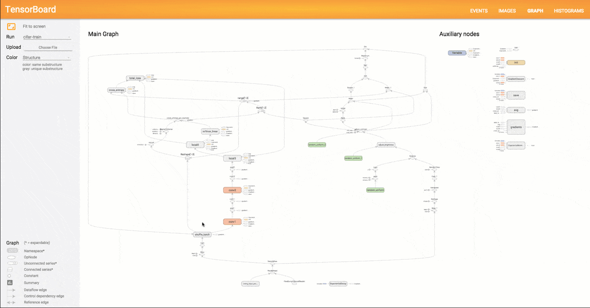 _TensorFlow 그래프의 시각화._

그래프를 보려면, TensorBoard를 실행할 때 로그 디렉토리를 입력한 후 상단 그래프 탭을 클릭하고 왼쪽 위 모서리에 있는 메뉴를 통해 적당한 작업을 선택하면 됩니다. TensorBoard를 어떻게 실행하는지와 필요한 정보를 기록하고 있는지 확인하는 방법에 대한 더 많은 정보를 보려면 [TensorBoard: 시각화 학습](index-2.md)를 참고하세요.

## 이름 범주화\(Name scoping\)와 노드

일반적으로 TensorFlow 그래프는 수천 개에 이르는 많은 노드를 가질 수 있습니다. 한 눈에 쉽게 보거나 보통의 그래프 도구를 이용해 그리기에는 너무 많죠. 그래서 변수의 이름을 그룹으로 묶어서\(name scoping\) 계층화하는 방법을 통해 간단하게 표현합니다. 처음에는 계층의 최상단에 있는 이름들만 보여지는 거죠. 여기 [`tf.name_scope`](../index-4/index-1/framework.md#name_scope)를 사용해 `hidden` name scope 아래에 세 가지 기능을 정의한 예가 있습니다:

```python
import tensorflow as tf

with tf.name_scope('hidden') as scope:
  a = tf.constant(5, name='alpha')
  W = tf.Variable(tf.random_uniform([1, 2], -1.0, 1.0), name='weights')
  b = tf.Variable(tf.zeros([1]), name='biases')
```

위의 예시 코드의 결과로 아래와 같은 세 가지 연산\(op\)의 이름이 나옵니다:

* 'hidden/alpha'
* 'hidden/weights'
* 'hidden/biases'

시각화를 거치면 이 세 가지 연산자\(op\)들은 `hidden` 라벨이 붙은 노드가 됩니다. 세부 내용은 그대로죠. 노드를 펼치려면 오른쪽 상단에 있는 주황색 `+` 표시를 클릭하거나 노드를 더블 클릭해 보세요. `alpha`, `weights`, `biases` 3개의 서브노드를 볼 수 있습니다.

이제 좀 더 복잡한 노드가 초기 상태와 펼쳐진 상태로 있는 현실적 예제를 살펴봅시다.

|  | 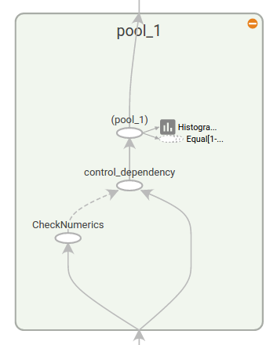 |
| :--- | :--- |
|  최상단 name scope `pool_1`의 초기 화면. 우측 상단의 주황색 `+` 버튼을 클릭하거나 노드를 더블 클릭하면 펼칠 수 있다. |  `pool_1` name scope가 펼치진 모습. 우측 상단의 주황색 `-` 버튼을 클릭하거나 노드를 더블 클릭하면 name scope를 접을 수 있다. |

노드를 이름 범주\(name scope\)로 묶는 것은 읽기 쉬운 그래프를 만들 때 중요합니다. 모델을 만들 때 이름 범주화를 이용하면 시각화된 결과를 제어하기 좋습니다. **이름 범주\(name scope\)를 잘 쓰면 시각화가 잘 됩니다.**

위 그림은 시각화의 두 번째 면을 보여줍니다. TensorFlow 그래프의 연결은 데이터 종속\(data dependency\)과 컨트롤 종속\(control dependency\) 두 가지 종류가 있습니다. 데이터 종속은 두 연산 사이 tensor의 흐름을 보여주는데 실선 화살표로 나타납니다. 반면 컨트롤 종속은 점선으로 나타납니다. \(위 그림 오른쪽 부분\) 펼쳐진 모습에서 `CheckNumerics`와 `control_dependency`를 연결하는 점선을 제외하고 모든 연결은 데이터 종속입니다.

레이아웃을 간단하게 하는 두 번째 트릭이 있습니다. 대부분의 TensorFlow 그래프는 다른 노드와 많이 연결된 몇 개의 노드로 이루어져 있습니다. 예를 들어, 많은 노드들이 초기화 단계에 컨트롤 종속을 가지고 있을 수 있습니다. 그래서 `init` 노드와 그 노드에 종속된 것들 사이의 모든 엣지\(edge\)를 그려보면 많은 실선들로 뭉쳐진 모습이 나타날 것입니다.

뭉쳐져 보이는 것을 줄이기 위해 시각화 프로그램은 모든 상위 노드를 우측에 있는 _auxiliary\(보조\)_ 공간에 분리해 두고 엣지를 나타내는 선을 그리지 않습니다. 선 대신에 연결을 나타내기 위해 작은 _노드 아이콘_을 그립니다. 보조 노드를 떼어놓더라도 중요한 정보가 사라지는 일은 잘 없습니다. 왜냐하면 이 노드들은 보통 부기 기능\(bookkeeping function\)과 관련있기 때문입니다. 메인 그래프과 보조 영역 사이에서 노드를 어떻게 움직이는지 보려면 [Interaction](index-3.md#interaction)를 보세요.

| 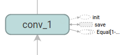 | 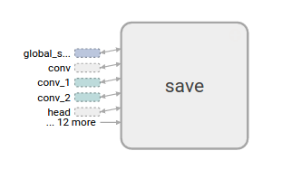 |
| :--- | :--- |
|  `conv_1` 노드는 `save` 와 연결되어 있습니다. 우측에 작은 `save` 노드 아이콘이 있는 것을 주의하세요. |  `save` 는 상위에 있고 보조 노드로 표시됩니다. `conv_1` 과의 연결은 그것의 왼쪽에 있는 노드 아이콘으로 표현됩니다. `save`가 많은 연결을 가지고 있기 때문에, 클러스터를 더 줄이기 위해, 처음 5개만 보여주고 나머지는 `... 12 more` 로 축약합니다. |

마지막 구조 단순화는 _series collapsing_ 입니다. 이름의 마지막 숫자만 다르고 같은 구조를 가진 노드인 순차적 모티프\(sequential motif\)는 아래에 나와 있는 것처럼 하나의 노드 스택으로 접을 수 있습니다. 긴 배열을 가진 네트워크의 경우, 이를 통해 모양이 굉장히 단순하게 됩니다. 노드의 계층을 나타낼 때와 마찬가지로, 더블 클릭해서 이 series를 펼칠 수 있습니다. 어떻게 특정 노드 셋이 접힌 것을 비활성화/활성화 하는지는 [Interaction](index-3.md#interaction)를 보세요.

|  |  |
| :--- | :--- |
|  노드 시퀸스가 접힌 모습. |  더블 클릭 후에 펼쳐진 모습의 일부분. |

마지막으로, 가독성을 높이기 위해, 시각화는 상수와 요약 노드를 위해 특별한 아이콘을 사용합니다. 간단히, 노드 기호 표가 있습니다:

| 기호 | 의미 |
| :--- | :--- |
|  | _High-level_ 노드는 name scope를 나타냅니다. high-level 노드를 펼치기 위해 더블 클릭 하세요. |
|  | 서로 연결되지 않은 숫자가 메겨진 노드의 시퀸스. |
|  | 서로 연결된 숫자가 메겨진 노드의 시퀸스. |
|  | 각각의 연산 노드. |
|  | 상수. |
|  | 요약 노드. |
|  | 간선은 연산 사이의 데이터 흐름을 보여줍니다. |
|  | 간선은 연산 사이의 컨트롤 종속을 보여줍니다. |
|  | 레퍼런스 간선은 나가는 연산 노드가 들어오는 tensor를 변형할 수 있다는 것을 보여줍니다. |

## Interaction <a id="interaction"></a>

줌과 이동 기능을 이용해서 그래프를 탐색할 수 있습니다. 화면을 클릭하고 드래그하고 줌하기 위해 스크롤을 사용하세요. 연산 그룹을 보여주는 이름 범주\(name scope\)를 펼치기 위해서는 노드를 더블 클릭 하거나 노드의 `+` 버튼을 누르세요. 줌과 이동 기능을 사용하더라도 지금의 위치를 손쉽게 파악할 수 있도록 우측 하단 모서리에 미니맵이 있습니다.

열린 노드를 닫기 위해 다시 한번 더블 클릭하거나 노드의 `-` 버튼을 누르세요. 노드를 선택하기 위해 한 번 누르셔도 됩니다. 노드는 어두운 색으로 변하고, 노드에 대한 세부 사항과 연결된 노드가 시각화의 우측 상단 모서리 정보 카드에 표시됩니다.

| 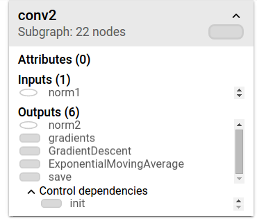 | 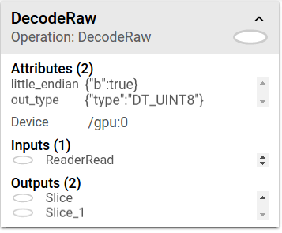 |
| :--- | :--- |
|  정보 카드가 `conv2` name scope의 세부 정보를 보여줍니다. 입력과 출력은 name scope 내의 연산 노드의 입력과 출력에서 결합됩니다. name scope에 대한 속성은 보여지지 않습니다. |  정보 카드가 `DecodeRaw` 연산 노드의 세부 정보를 보여줍니다. 입력과 출력에 더해서, 카드는 현재 연산에 관련된 디바이스와 속성들을 보여줍니다. |

TensorBoard는 그래프의 레이아웃을 바꿀 수 있는 몇 가지 방법을 제공합니다. 이것이 그래프의 연산 의미를 바꾸지는 않지만 네트워크 구조를 좀 더 명확하게 합니다. 노드를 우클릭하거나 정보 카드 하단에 있는 버튼을 눌러서 레이아웃에 아래와 같은 변화를 줄 수 있습니다:

* 노드는 메인 그래프와 보조 영역 사이를 이동할 수 있습니다.
* 연속된\(series\) 노드를 그룹 해제해서 이 노드들이 그룹으로 함께 보여지지 않게 합니다. 그룹 해제된 series는 같은 방법으로 재그룹화 할 수 있습니다.

선택 기능은 상위 노드를 이해하는 것에도 도움이 됩니다. 어떤 상위 노드를 선택하면 다른 연결을 위해 대응하는 노드 아이콘도 또한 선택됩니다. 예를 들어, 이것은 어떤 노드가 저장되고 어떤 것이 안됐는지를 보기 쉽게 만들어 줍니다.

정보 카드에 있는 노드 이름을 클릭하면 해당 노드를 선택할 수 있습니다. 필요하다면, 노드를 볼 수 있도록 화면이 자동으로 이동합니다.

마지막으로, 상단 표에 있는 컬러 메뉴를 이용해 그래프에 두 가지 색을 선택할 수 있습니다. 기본 _Structure View_ 는 구조를 보여줍니다: 두 상위 레벨의 노드가 같은 구조이면 같은 색으로 표현됩니다. 유일한 구조를 가진 노드는 회색입니다. 어떤 디바이스가 다른 연산을 실행하고 있는지 보여주는 두 번째 화면도 있습니다. 이름 범주\(name scope\)는 내부 연산에 대한 장치의 비율에 비례해서 색이 지정됩니다.

아래의 이미지는 실제 그래프 중 일부분을 보여줍니다.

| 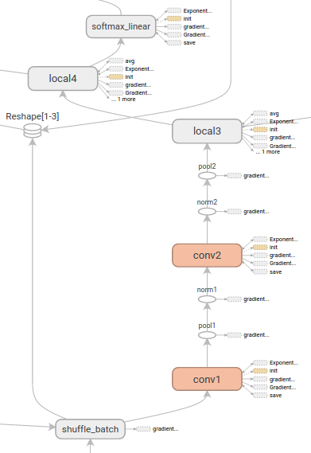 | 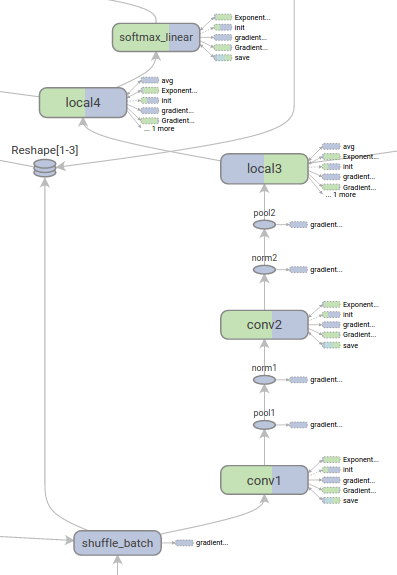 |
| :--- | :--- |
|  Structure view: 회색 노드는 유일한 구조를 가지고 있습니다. 주황색 `conv1` 과 `conv2` 노드는 같은 구조를 가지고 있고 다른 색을 가진 노드와 비슷합니다. |  Device view: Name scope는 내부 연산 노드의 장치 비율에 비례해서 색이 지정됩니다. 여기서는 보라색이 GPU를 의미하고 초록색이 CPU를 의미합니다. |

## 텐서의 형태 정보\(Tensor shape information\)

텐서의 형태가 연속된 `GraphDef`에 포함되면 그래프 시각화 프로그램이 텐서의 차원을 엣지에 표시하고 텐서의 크기는 엣지의 두깨로 나타냅니다. `GraphDef`에 텐서 형태를 포함하기 위해서는 그래프를 연속화할 때 실제 그래프 객체\(`sess.graph`와 같이\)를 `SummaryWriter` 에 전달합니다. 아래의 이미지는 텐서의 형태 정보를 가진 CIFAR-10 모델을 보여줍니다:

| 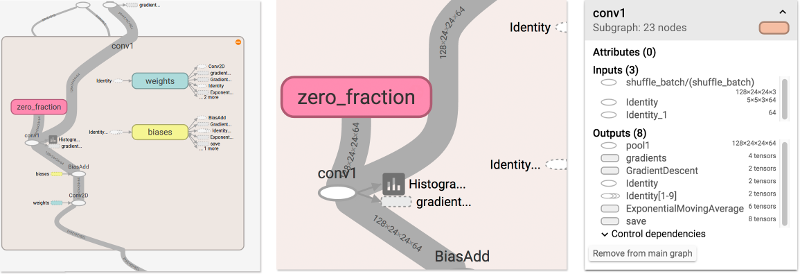 |
| :--- |
|  텐서 형태 정보를 가진 IFAR-10 모델. |

## Runtime statistics

실행할 때 총 메모리 사용량, 총 계산 시간, 노드의 tensor 형태와 같은 런타임 메타데이터를 수집하면 보통 도움이 됩니다. 아래의 코드 예제는 [simple MNIST tutorial](../index-2/undefined/index.md)의 수정본 중 훈련과 테스트 부분에서 발췌한 내용으로 요약과 런타임 통계를 기록하는 부분입니다. 요약을 어떻게 기록하는지는 [Summaries Tutorial](index-2.md#serializing-the-data)을 보세요. 전체 소스는 [여기](https://www.tensorflow.org/code/tensorflow/examples/tutorials/mnist/mnist_with_summaries.py)에 있습니다.

```python
  # 모델을 트레이닝하고 또한 요약을 작성합니다.
  # 매 10번째 순서 마다, 테스트 셋의 정확도를 측정하고 테스트 요약을 작성합니다.
  # 다른 모든 순서에서 트레이닝 데이터로 트레이닝 단계를 실행하고 트레이닝 요약을 작성합니다.

  def feed_dict(train):
    """Make a TensorFlow feed_dict: maps data onto Tensor placeholders."""
    if train or FLAGS.fake_data:
      xs, ys = mnist.train.next_batch(100, fake_data=FLAGS.fake_data)
      k = FLAGS.dropout
    else:
      xs, ys = mnist.test.images, mnist.test.labels
      k = 1.0
    return {x: xs, y_: ys, keep_prob: k}

  for i in range(FLAGS.max_steps):
    if i % 10 == 0:  # 요약과 테스트 셋 정확도를 기록한다
      summary, acc = sess.run([merged, accuracy], feed_dict=feed_dict(False))
      test_writer.add_summary(summary, i)
      print('Accuracy at step %s: %s' % (i, acc))
    else:  # 트레이닝 셋 요약을 기록하고 트레이닝한다 
      if i % 100 == 99:  # 실행 통계를 기록한다
        run_options = tf.RunOptions(trace_level=tf.RunOptions.FULL_TRACE)
        run_metadata = tf.RunMetadata()
        summary, _ = sess.run([merged, train_step],
                              feed_dict=feed_dict(True),
                              options=run_options,
                              run_metadata=run_metadata)
        train_writer.add_run_metadata(run_metadata, 'step%d' % i)
        train_writer.add_summary(summary, i)
        print('Adding run metadata for', i)
      else:  # 요약을 기록한다
        summary, _ = sess.run([merged, train_step], feed_dict=feed_dict(True))
        train_writer.add_summary(summary, i)
```

이 코드는 99 번째부터 매 100 번째마다 런타임 통계를 내보냅니다.

tensorboard를 시작하고 그래프 탭으로 가면, 실행 메타데이터가 추가된 단계에 대응하는 "Sessopm runs" 아래 옵션들을 볼 수 있습니다. 이 중 하나를 선택하면 사용되지 않는 노드들은 가려줘서 해당 단계에서 네트워크의 상태를 볼 수 있습니다. 왼쪽의 컨트롤에서 총 메모리 또는 총 계산 시간으로 노드의 색을 지정할 수 있습니다. 추가적으로, 노드를 클릭하면 정확한 총 메모리, 계산 시간, 텐서 출력 크기를 보여줍니다.

| 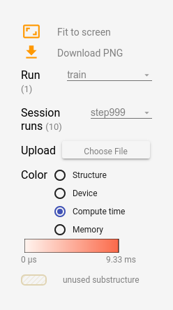 | 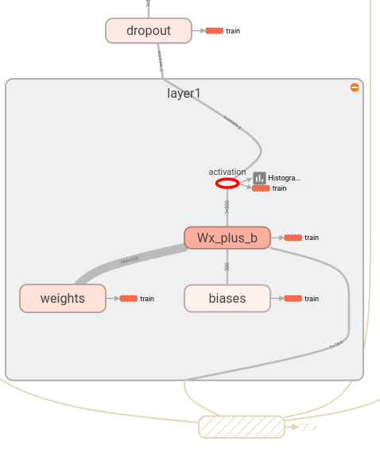 | 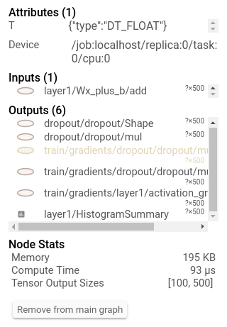 |
| :--- | :--- | :--- |


