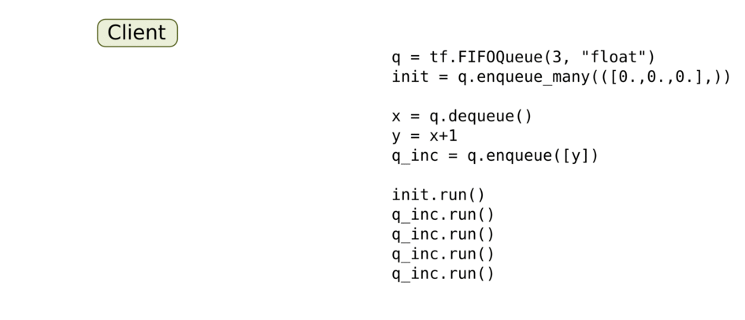

# 쓰레드와 큐

큐는 TensorFlow 를 사용하는 비동기 계산에 대해 강력한 메커니즘이다.

TensorFlow 의 다른 모든 것들처럼, 하나의 큐는 TensorFlow 그래프에서 하나의 노드다. 이는 변수\(variable\)와 비슷한, 상태저장 노드다: 다른 노드들은 그 저장물\(콘텐츠\)의 수정이 가능하다. 특히, 노드들은 큐에 새로운 아이템들을 추가할 수 있거나 큐에 존재하는 아이템들을 해제할 수 있다.

큐에 대한 감을 잡기 위해, 간단한 예제를 생각해보자. 우리는 "first in, first out" 큐\(`FIFOQueus`\) 를 만들어볼 것이고, 이를 0 으로 채울 것이다. 다음으로 큐에서 아이템을 제거, 아이템을 추가, 그리고 큐 끝에 이를 다시 넣는 그래프를 만들것이다. 큐의 숫자들은 천천히 증가한다.



`Enqueue`, `EnqueueMany`, 그리고 `Dequeue` 는 특별 노드들이다. 이들은 평범한 값 대신 큐에 대한 포인터를 가지며, 이들은 이 포인터를 변경할 수 있다. 우리는 큐의 매쏘드\(method\)들과 같은 것에 대해 생각해보길 권한다. 사실, Python API 에서, 이들은 큐 객체에 대한 매쏘드\(method\)들이다\(`q.enqueue(...)`\).

**주의** 큐 매쏘드들\(method\)\(`q.enqueue(...)`와 같은\)은, 큐 처럼, _반드시_ 같은 장치에서 실행해야 한다. 이들 연산이 생성될 때 호환성이 없는 장치 배치 지시들\(Incompatible device placement directives\) 은 무시될 것이다.

이제 큐에 대한 감을 조금 가졌을 것이고, 자세한 부분으로 들어가보자...

## 큐 사용 개요

큐들은, `FIFOQueue` 와 `RandomShffleQueue` 와 같은, 그래프에서 비동기로 tensor 들을 계산하기 위한 중요한 TensorFlow 객체들이다.

예를 들어, 대표적인 입력 아키텍쳐는 모델 학습을 위한 입력들을 준비하기 위해 `RandomShuffleQueue`를 사용해야 한다:

* 다수의 쓰레드들은 학습 예제들을 대비하고 이들을 큐에 넣는다.
* 학습하는 쓰레드는 큐에서 mini-batches 를 빼내는 학습 연산을 실행한다.

이 아키텍쳐는, 입력 파이프라인들의 구성을 간략화하는 함수들에 대한 개요를 알려주는 [Reading data how to](https://github.com/kcpTest/kcpdoc.github.io/tree/175cc1e2b5647b1d23bd344ee89261f22c14f9e2/g3doc/how_tos/reading_data/README.md) 에서 강조되었던 것처럼, 많은 이점들을 가진다.

TensorFlow `Session` 객체는 멀티 쓰레드화 되어있다. 그래고 다수 쓰레드들은 같은 세션 사용을 쉽게할 수 있고 병렬로 연산들을 실행할 수 있다. 그러나, 위에서 묘사된 것처럼 쓰레드들을 다루는 Python 프로그램을 구현하는 것이 항상 쉽지만은 않다. 모든 쓰레드들은 함께 멈춰질 수 있어야 하며, 예외처리들은 처리되어야 하고 알려져야 한다. 그리고 큐는 멈췄을 때 적절하게 종료되어야 한다.

TensorFlow 는 도움을 주는 두 클래스들을 제공한다: [tf.Coordinator](../index-4/index-1/train.md#Coordinator) 와 [tf.QueueRunner](../index-4/index-1/train.md#QueueRunner). 이들 두 클래스들은 함께 사용되기 위해 디자인되었다. `Coordinator` 클래스는 멀티 쓰레드들이 함께 정지되도록 돕고 예외처리들을 그들이 정지되기 위해 대기하는 프로그램에 알린다. `QueueRunner` 클래스는 같은 큐 안의 tensors 를 추가하기 위해 협력하는 많은 쓰레드들을 생성한다.

## 조정자\(Coordinator\)

조정자 클래스는 멀티 쓰레드들이 같이 정지되도록 한다.

이것의 핵심 매쏘드들은 아래와 같다:

* `should_stop()`: 쓰레드들이 정지되어야 한다면 True 값을 반환한다.
* `request_stop(<exception>)`: 쓰레드들이 정지되어야 함을 요청한다.
* \`join\(\): 특정 쓰레드들이 멈출 때 까지 대기한다.

당신은 우선 `Coordinator` 객체를 생성하고, 다음으로 coordinator 를 사용하는 쓰레드들을 생성한다. 일반적으로 쓰레드들은 `should_stop()` 이 `True` 를 반환할 때 멈추는 루프를 실행한다.

어떤 쓰레드는 멈춰야 하는 계산을 결정할 수 있다. 이것은 `request_stop()` 함수를 부르는 것이고 다른 쓰레드들은 `should_stop()` 함수가 `True` 값을 반환한 다음 정지된다.

```python
# 쓰레드 body: coordinator 가 정지가 요청됨을 알릴 때까지 반복
# 어떤 조건이 true 가 이면, coordinator 가 멈출 것을 요청
def MyLoop(coord):
  while not coord.should_stop():
    ...do something...
    if ...some condition...:
      coord.request_stop()

# Main code: coordinator 생성
coord = Coordinator()

# 'MyLoop()' 를 실행하는 10개의 쓰레드를 생성
threads = [threading.Thread(target=MyLoop, args=(coord,)) for i in xrange(10)]

# 쓰레드들을 시작하고 그들 모두의 정지를 위한 대기
for t in threads: t.start()
coord.join(threads)
```

분명히, coordinator 는 다양한 처리를 하는 쓰레드들을 관리할 수 있다. 이들은 위 예제와 같이 모두 같지는 않다. 또한 coordinator 는 예외처리들을 감지하고 알린다. 자세한 것은 [Coordinator class](../index-4/index-1/train.md#Coordinator) 문서를 살펴보자.

## QueueRunner

`QueueRunner` 클래스는 enqueue 연산을 반복적으로 실행하는 쓰레드들을 생성한다. 이들 쓰레드들은 coordinatoror 를 이용해 함께 정지하도록 할 수 있다. 추가로, queue runner 는 예외처리가 coordinator 에 보고하면 자동적으로 queue 를 종료하는 _closer thread_ 를 실행한다.

당신은 위에 설명된 아키텍처 구현을 위해 queue runner 를 사용할 수 있다.

우선 입력 예제들에 대해 `Queue`를 사용하는 그래프를 만든다. 예제들을 처리하고 큐에 이들을 추가하는 연산을 추가한다. 큐에서 해제하는 것을 시작하는 학습 연산들을 추가한다.

```python
example = ...예제를 생성하는 연산들...
# 큐와 큐에 차례로 예제들을 추가하는 연산을 생성한다.
queue = tf.RandomShuffleQueue(...)
enqueue_op = queue.enqueue(example)
# 예제들을 큐에서 해제하도록 하는 학습 그래프를 생성한다.
inputs = queue.dequeue_many(batch_size)
train_op = ...그래프의 학습 부분을 만들기 위한 'inputs' 을 사용
```

Python 학습 프로그램에서, 예제들을 처리하고 큐에 추가하기 위한 쓰레드들을 실행할 `QueueRunner` 를 생성한다. `Coordinator` 를 생성하고 queue runner 가 coordinator 와 함께 이들의 쓰레드들을 시작하는 것을 요청한다. coordinator 를 사용하는 학습 루프를 적어보자.

```text
# 예제들을 큐에 병렬로 추가하기 위한 4 쓰레드를 실행할 queue runner 를 생성한다.
qr = tf.train.QueueRunner(queue, [enqueue_op] * 4)

# 그래프 시작
sess = tf.Session()
# queue runner 쓰레드들을 실행하는 coordinator 생성
coord = tf.train.Coordinator()
enqueue_threads = qr.create_threads(sess, coord=coord, start=True)
# coordinator 와 함께 종료를 제어하는 학습 루프를 실행
for step in xrange(1000000):
    if coord.should_stop():
        break
    sess.run(train_op)
# 완료 후, 쓰레드에 정지 요청
coord.request_stop()
# 실제 정지하기를 대기
coord.join(threads)
```

## 예외처리 다루기

queue runner 에 의해 시작된 쓰레드들은 그냥 연산들을 큐에 추가하여 실행하는 것보다 더 많은 일을 수행한다. 또한 이들은 큐가 닫혔음을 알리기 위해 사용되는 `OutOfRangeError` 를 포함하여, 큐에 의해 생성된 예외처리들을 포착하고 처리한다.

coordinator 를 사용하는 학습 프로그램은 마찬가지로 이들의 메인 루프에서 예외처리들을 포착하고 알려야 한다.

아래는 위 학습 루프의 향상된 버전이다.

```python
try:
    for step in xrange(1000000):
        if coord.should_stop():
            break
        sess.run(train_op)
except Exception, e:
    # Report exceptions to the coordinator.
    coord.request_stop(e)
finally:
    # Terminate as usual.  It is innocuous to request stop twice.
    coord.request_stop()
    coord.join(threads)
```

