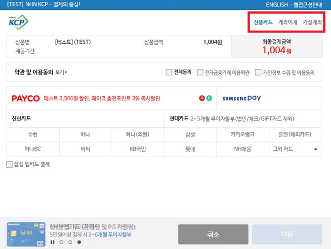

# 주문요청

## 주문요청\(PC\)

### 1.스크립트 구성

**callback 함수 m\_Completepayment 안내**  
① 해당 함수는 결제 창 인증 완료 후 승인요청 처리를 위한 함수 \(비동기식으로의 변경에 따른 함수 추가\)  
② 해당 함수 명은 변경 불가  
③ 해당 함수의 위치는 결제 창 호출 js\_url 보다 반드시 먼저 선언  
④ 표준웹 방식의 경우 리턴 값이 form 으로 넘어옴

```text
function m_Completepayment( FormOrJson, closeEvent )
{
        var frm = document.order_info; // submit 시킬 폼데이터 지정

        /********************************************************************/
        /* FormOrJson은 가맹점 임의 활용 금지                               */
        /* frm 값에 FormOrJson 값이 설정 됨 frm 값으로 활용 하셔야 됩니다.  */
        /* FormOrJson 값을 활용 하시려면 기술지원팀으로 문의바랍니다.       */
        /********************************************************************/
                 GetField( frm, FormOrJson );            

        if( frm.res_cd.value == "0000" )
        {
                /*
                가맹점 리턴값 처리 영역
                */
                frm.submit(); // 
        }
        else
        {
                alert( "[" + frm.res_cd.value + "] " + frm.res_msg.value );
                closeEvent();
        }
}
```

**결제창 실행함수**

```text
/* 표준웹 실행 */
function jsf__pay( form )
{
    try
    {
        KCP_Pay_Execute( form ); 
    }
    catch (e)
    {
        /* IE 에서 결제 정상종료시 throw로 스크립트 종료 */ 
    }
}
```

**결제확인 버튼**

* callback 함수를 통하여 submit 여부를 정함

**표준WEB방식**

```text
<input name=“” type=”button” class=”submit” value=”결제요청” onclick=”jsf__pay(this.form);”/>
```

### 2.주문요청 파라미터

<table>
  <thead>
    <tr>
      <th style="text-align:left"></th>
      <th style="text-align:left"><b>Parameter</b>
      </th>
      <th style="text-align:left"><b>Type</b>
      </th>
      <th style="text-align:left">Max Length</th>
      <th style="text-align:left">&#xD544;&#xC218; &#xC5EC;&#xBD80;</th>
      <th style="text-align:left">Description</th>
    </tr>
  </thead>
  <tbody>
    <tr>
      <td style="text-align:left">1</td>
      <td style="text-align:left">req_tx</td>
      <td style="text-align:left">String</td>
      <td style="text-align:left">3</td>
      <td style="text-align:left">Y</td>
      <td style="text-align:left">
        <p>&#xC694;&#xCCAD;&#xC758; &#xC885;&#xB958;&#xB97C; &#xAD6C;&#xBD84;&#xD558;&#xB294;
          &#xBCC0;&#xC218;</p>
        <p>&#xACB0;&#xC81C;&#xC694;&#xCCAD;&#xD398;&#xC774;&#xC9C0;&#xC758; &#xACBD;&#xC6B0;
          &#x2018;pay&#x2019;&#xB85C; &#xC124;&#xC815;</p>
      </td>
    </tr>
    <tr>
      <td style="text-align:left">2</td>
      <td style="text-align:left">site_name</td>
      <td style="text-align:left">String</td>
      <td style="text-align:left">20</td>
      <td style="text-align:left">N</td>
      <td style="text-align:left">&#xC0C1;&#xC810;&#xC774;&#xB984;(&#xC601;&#xBB38;&#xC73C;&#xB85C; &#xC791;&#xC131;&#xAD8C;&#xC7A5;)</td>
    </tr>
    <tr>
      <td style="text-align:left">3</td>
      <td style="text-align:left">site_cd</td>
      <td style="text-align:left">String</td>
      <td style="text-align:left">5</td>
      <td style="text-align:left">Y</td>
      <td style="text-align:left">&#xC0C1;&#xC810;&#xCF54;&#xB4DC;</td>
    </tr>
    <tr>
      <td style="text-align:left">4</td>
      <td style="text-align:left">ordr_idxx</td>
      <td style="text-align:left">String</td>
      <td style="text-align:left">40</td>
      <td style="text-align:left">Y</td>
      <td style="text-align:left">
        <p>&#xC0C1;&#xC810; &#xAD00;&#xB9AC; &#xC8FC;&#xBB38;&#xBC88;&#xD638; (&#xC720;&#xB2C8;&#xD06C;&#xD55C;
          &#xAC12; &#xC124;&#xC815; &#xAD8C;&#xC7A5;)</p>
        <p><b>&#x203B; &#xC8FC;&#xBB38;&#xBC88;&#xD638;&#xB294; &#xC601;&#xBB38;&#xACFC; &#xC22B;&#xC790;&#xB85C; &#xC124;&#xC815;&#xD558;&#xC154;&#xC57C; &#xD569;&#xB2C8;&#xB2E4;.</b>
        </p>
      </td>
    </tr>
    <tr>
      <td style="text-align:left">5</td>
      <td style="text-align:left">pay_method</td>
      <td style="text-align:left">String</td>
      <td style="text-align:left">12</td>
      <td style="text-align:left">Y</td>
      <td style="text-align:left">
        <p><b>&#xACB0;&#xC81C;&#xC218;&#xB2E8;&#xCF54;&#xB4DC;</b>
        </p>
        <p>12&#xC790;&#xB9AC; &#xC22B;&#xC790;&#xB85C; &#xAD6C;&#xC131;</p>
        <p>(&#xC0AC;&#xC6A9; : 1, &#xC0AC;&#xC6A9; &#xC548; &#xD568; : 0)</p>
        <p>&#xC2E0;&#xC6A9;&#xCE74;&#xB4DC; : 100000000000</p>
        <p>&#xACC4;&#xC88C;&#xC774;&#xCCB4; : 010000000000</p>
        <p>&#xAC00;&#xC0C1;&#xACC4;&#xC88C; : 001000000000</p>
        <p>&#xD3EC; &#xC778; &#xD2B8; : 000100000000</p>
        <p>&#xD734; &#xB300; &#xD3F0; : 000010000000</p>
        <p>&#xC0C1; &#xD488; &#xAD8C; : 000000001000</p>
        <p>&#xC2E0;&#xC6A9;&#xCE74;&#xB4DC;, &#xACC4;&#xC88C;&#xC774;&#xCCB4;, &#xAC00;&#xC0C1;&#xACC4;&#xC88C;&#xB97C;
          &#xD558;&#xB098;&#xC758; &#xACB0;&#xC81C; &#xCC3D;&#xC5D0; &#xAC19;&#xC774;
          &#xB098;&#xD0C0;&#xB098;&#xAC8C; &#xD558;&#xB294; &#xACBD;&#xC6B0;&#xC758;
          pay_method&#xB294; &#x2018;111000000000&#x2019; &#xB85C; &#xC124;&#xC815;</p>
      </td>
    </tr>
    <tr>
      <td style="text-align:left">6</td>
      <td style="text-align:left">good_name</td>
      <td style="text-align:left">String</td>
      <td style="text-align:left">100</td>
      <td style="text-align:left">Y</td>
      <td style="text-align:left">
        <p>&#xC0C1;&#xD488;&#xBA85;</p>
        <p><b>&#x203B; &#xACE0;&#xAC1D;&#xC548;&#xB0B4; &#xBC0F; &#xC8FC;&#xBB38;&#xC815;&#xBCF4; &#xAD00;&#xB9AC; &#xC704;&#xD574; &#xC815;&#xD655;&#xD55C; &#xC0C1;&#xD488;&#xBA85;&#xC73C;&#xB85C; &#xC124;&#xC815;&#xD558;&#xC154;&#xC57C; &#xD569;&#xB2C8;&#xB2E4;.</b>
        </p>
      </td>
    </tr>
    <tr>
      <td style="text-align:left">7</td>
      <td style="text-align:left">good_mny</td>
      <td style="text-align:left">Number</td>
      <td style="text-align:left">12</td>
      <td style="text-align:left">Y</td>
      <td style="text-align:left">
        <p>&#xC8FC;&#xBB38;&#xC694;&#xCCAD;&#xAE08;&#xC561;</p>
        <p>(&#xACB0;&#xC81C; &#xCC3D;&#xC73C;&#xB85C; &#xC804;&#xB2EC;&#xD558;&#xB294;
          &#xAE08;&#xC561;&#xC73C;&#xB85C; &#xACB0;&#xC81C; &#xCC3D;&#xC5D0; &#xBCF4;&#xC5EC;&#xC9C0;&#xB294; <b>&#xC2E4;&#xC81C; &#xACB0;&#xC81C;&#xAE08;&#xC561;&#xC774; &#xC544;&#xB2D8;</b>)</p>
        <p>&#xACB0;&#xC81C;&#xCC3D;&#xC774; &#xB2EB;&#xD78C; &#xD6C4; ordr_chk &#xAC12;&#xC5D0;
          &#xB9AC;&#xD134;&#xB418;&#xB294; &#xAE08;&#xC561;&#xC815;&#xBCF4;&#xAC00;
          &#xBCC0;&#xACBD;&#xB418;&#xB294;&#xC9C0; &#xCCB4;&#xD06C;</p>
        <p> <b>&#x203B; &#xD654;&#xD3D0;&#xB2E8;&#xC704;&#xAC00; &#x2018;USD&#x2019; &#xC77C; &#xACBD;&#xC6B0;, Cent&#xAE4C;&#xC9C0; &#xC124;&#xC815;</b>
        </p>
        <p>ex ) $10.55 &#xC77C; &#xACBD;&#xC6B0; &#xCF64;&#xB9C8;&#xB97C; &#xBE80;
          1055</p>
        <p>$100 &#xC77C; &#xACBD;&#xC6B0; 10000&#xB85C; &#xC124;&#xC815;</p>
        <p><b>&#xACB0;&#xC81C; &#xAE08;&#xC561;&#xC740; &#xC22B;&#xC790; &#xC774;&#xC678;&#xC758; &#xBB38;&#xC790;(&#xCF64;&#xB9C8; &#xB4F1;)&#xB294; &#xD5C8;&#xC6A9;&#xD558;&#xC9C0; &#xC54A;&#xC2B5;&#xB2C8;&#xB2E4;</b>
        </p>
      </td>
    </tr>
    <tr>
      <td style="text-align:left">8</td>
      <td style="text-align:left">buyr_name</td>
      <td style="text-align:left">String</td>
      <td style="text-align:left">30</td>
      <td style="text-align:left">N</td>
      <td style="text-align:left">&#xC8FC;&#xBB38;&#xC790; &#xC774;&#xB984;</td>
    </tr>
    <tr>
      <td style="text-align:left">9</td>
      <td style="text-align:left">buyr_mail</td>
      <td style="text-align:left">String</td>
      <td style="text-align:left">50</td>
      <td style="text-align:left">N</td>
      <td style="text-align:left">&#xC8FC;&#xBB38;&#xC790; &#xC774;&#xBA54;&#xC77C;</td>
    </tr>
    <tr>
      <td style="text-align:left">10</td>
      <td style="text-align:left">buyr_tel1</td>
      <td style="text-align:left">String</td>
      <td style="text-align:left">20</td>
      <td style="text-align:left">N</td>
      <td style="text-align:left">&#xC8FC;&#xBB38;&#xC790; &#xC804;&#xD654;&#xBC88;&#xD638;</td>
    </tr>
    <tr>
      <td style="text-align:left">11</td>
      <td style="text-align:left">buyr_tel2</td>
      <td style="text-align:left">String</td>
      <td style="text-align:left">20</td>
      <td style="text-align:left">Y</td>
      <td style="text-align:left">&#xC8FC;&#xBB38;&#xC790; &#xD734;&#xB300;&#xD3F0;&#xBC88;&#xD638;</td>
    </tr>
    <tr>
      <td style="text-align:left">12</td>
      <td style="text-align:left">currency</td>
      <td style="text-align:left">String</td>
      <td style="text-align:left">3</td>
      <td style="text-align:left">Y</td>
      <td style="text-align:left">
        <p>&#xD654;&#xD3D0;&#xB2E8;&#xC704;</p>
        <p>&#xC6D0;&#xD654; : WON / &#xB2EC;&#xB7EC; : USD</p>
        <p>&#xB2EC;&#xB7EC;&#xC758; &#xACBD;&#xC6B0; NHN KCP&#xC5D0; &#xBCC4;&#xB3C4;&#xC758;
          &#xC2E0;&#xCCAD;(&#xAD6D;&#xC81C; &#xC138;&#xBBF8;&#xB098;, &#xAD6D;&#xC81C;
          &#xD559;&#xC220;&#xB300;&#xD68C; &#xB4F1;&#xB9CC; &#xC2E0;&#xCCAD; &#xAC00;&#xB2A5;)&#xD574;&#xC57C;
          &#xC0AC;&#xC6A9; &#xAC00;&#xB2A5;</p>
      </td>
    </tr>
    <tr>
      <td style="text-align:left">13</td>
      <td style="text-align:left">shop_user_id</td>
      <td style="text-align:left">String</td>
      <td style="text-align:left">20</td>
      <td style="text-align:left">Y</td>
      <td style="text-align:left">
        <p>&#xC1FC;&#xD551;&#xBAB0;&#xD68C;&#xC6D0;ID</p>
        <p>&#xAE30;&#xAD00;&#xC5D0; &#xB530;&#xB77C; RM &#xC870;&#xCE58;&#xB97C;
          &#xC704;&#xD574; &#xC1FC;&#xD551;&#xBAB0; &#xAD00;&#xB9AC; ID&#xB97C; &#xD544;&#xC218;&#xB85C;
          &#xC694;&#xCCAD;</p>
        <p>&#xD734;&#xB300;&#xD3F0;&#xC18C;&#xC561;&#xACB0;&#xC81C; &#x2013; 40Byte</p>
        <p>&#xC0C1;&#xD488;&#xAD8C;&#xACB0;&#xC81C; &#x2013; 20Byte</p>
      </td>
    </tr>
  </tbody>
</table>

**※ pay\_method = “111000000000” 로 설정 했을 때 보여지는 결제 창**



### 3.신용카드 옵션처리 파라미터

<table>
  <thead>
    <tr>
      <th style="text-align:left"></th>
      <th style="text-align:left"><b>Parameter</b>
      </th>
      <th style="text-align:left"><b>Type</b>
      </th>
      <th style="text-align:left">Max Length</th>
      <th style="text-align:left">&#xD544;&#xC218; &#xC5EC;&#xBD80;</th>
      <th style="text-align:left">Description</th>
    </tr>
  </thead>
  <tbody>
    <tr>
      <td style="text-align:left">1</td>
      <td style="text-align:left">quotaopt</td>
      <td style="text-align:left">Number</td>
      <td style="text-align:left">2</td>
      <td style="text-align:left">N</td>
      <td style="text-align:left">50,000&#xC6D0; &#xC774;&#xC0C1; &#xAC70;&#xB798;&#xC5D0; &#xB300;&#xD55C;
        &#xD560;&#xBD80; &#xC635;&#xC158;. &#xAE30;&#xBCF8;&#xAC12;&#xC740; 12&#xAC1C;&#xC6D4;.
        0~12&#xC758; &#xAC12;&#xC744; &#xC124;&#xC815;&#xD558;&#xBA74; &#xACB0;&#xC81C;
        &#xCC3D;&#xC5D0; &#xD560;&#xBD80; &#xAC1C;&#xC6D4; &#xC218;&#xAC00; &#xCD5C;&#xB300;&#xAC12;&#xAE4C;&#xC9C0;
        &#xD45C;&#xAE30;&#xB428;</td>
    </tr>
    <tr>
      <td style="text-align:left">2</td>
      <td style="text-align:left">kcp_noint</td>
      <td style="text-align:left">String</td>
      <td style="text-align:left">1</td>
      <td style="text-align:left">N</td>
      <td style="text-align:left">
        <p>&#xBB34;&#xC774;&#xC790;&#xD560;&#xBD80; &#xD45C;&#xC2DC;&#xAE30;&#xB2A5;</p>
        <p>&#x201C;&#x201D; : &#xC0C1;&#xC810;&#xAD00;&#xB9AC;&#xC790; &#xC124;&#xC815;&#xC5D0;
          &#xB530;&#xB984;</p>
        <p>&#x201C;Y&#x201D; : kcp_noint_quota &#xAC12;&#xC5D0; &#xB530;&#xB77C;
          &#xBB34;&#xC774;&#xC790;&#xD45C;&#xC2DC;(&#xB2E8;, &#xC0C1;&#xC810;&#xAD00;&#xB9AC;&#xC790;&#xC5D0;
          &#xC124;&#xC815;&#xC774; &#xB418;&#xC5B4;&#xC57C; &#xD568;)</p>
        <p>&#x201C;N&#x201D; : &#xC0C1;&#xC810;&#xAD00;&#xB9AC;&#xC790; &#xAC12;&#xC744;
          &#xBB34;&#xC2DC;&#xD558;&#xACE0; &#xC77C;&#xBC18;&#xD560;&#xBD80;&#xB85C;
          &#xCC98;&#xB9AC;&#xB428;</p>
      </td>
    </tr>
    <tr>
      <td style="text-align:left">3</td>
      <td style="text-align:left">kcp_noint_quota</td>
      <td style="text-align:left">String</td>
      <td style="text-align:left">256</td>
      <td style="text-align:left">N</td>
      <td style="text-align:left">
        <p>&#xBB34;&#xC774;&#xC790;&#xD560;&#xBD80; &#xD45C;&#xC2DC;&#xAE30;&#xB2A5;&#xC774;
          Y &#xC77C; &#xACBD;&#xC6B0; &#xBB34;&#xC774;&#xC790; &#xC124;&#xC815; &#xAC12;&#xC744;
          &#xACB0;&#xC81C; &#xCC3D;&#xC5D0; &#xD45C;&#xAE30; &#xBB34;&#xC774;&#xC790;
          &#xC124;&#xC815;&#xC740; &#xCE74;&#xB4DC;&#xC0AC; &#xBCC4;&#xB85C; &#xC124;&#xC815;
          &#xAC00;&#xB2A5;</p>
        <p>&#x203B; &#xD45C; &#xC544;&#xB798; &#xCD94;&#xAC00; &#xC548;&#xB0B4;&#xC0AC;&#xD56D;
          &#xD655;&#xC778;</p>
      </td>
    </tr>
    <tr>
      <td style="text-align:left">4</td>
      <td style="text-align:left">used_card_YN</td>
      <td style="text-align:left">String</td>
      <td style="text-align:left">1</td>
      <td style="text-align:left">N</td>
      <td style="text-align:left">
        <p>&#xACB0;&#xC81C; &#xC694;&#xCCAD; &#xC2DC; &#xC6D0;&#xD558;&#xB294; &#xC2E0;&#xC6A9;&#xCE74;&#xB4DC;&#xC0AC;
          &#xD655;&#xC778;</p>
        <p>&#xD574;&#xB2F9; &#xBCC0;&#xC218; &#xAC12;&#xC744; Y&#xB85C; &#xC124;&#xC815;
          &#xD6C4; used_card &#xBCC0;&#xC218; &#xAC12;&#xC5D0; &#xC6D0;&#xD558;&#xB294;
          &#xC2E0;&#xC6A9;&#xCE74;&#xB4DC;&#xC0AC;&#xC758; &#xCF54;&#xB4DC;&#xB97C;
          &#xC785;&#xB825;&#xD558;&#xBA74; &#xC785;&#xB825;&#xD55C; &#xC2E0;&#xC6A9;&#xCE74;&#xB4DC;&#xC0AC;&#xB9CC;
          &#xACB0;&#xC81C; &#xCC3D;&#xC5D0; &#xB178;&#xCD9C;</p>
      </td>
    </tr>
    <tr>
      <td style="text-align:left">5</td>
      <td style="text-align:left">used_card</td>
      <td style="text-align:left">String</td>
      <td style="text-align:left">256</td>
      <td style="text-align:left">N</td>
      <td style="text-align:left">
        <p>used_card_YN &#xBCC0;&#xC218; &#xAC12;&#xC744; Y&#xB85C; &#xC124;&#xC815;&#xD55C;
          &#xD6C4; &#xC0AC;&#xC6A9;&#xD558;&#xAE38; &#xC6D0;&#xD558;&#xB294; &#xC2E0;&#xC6A9;&#xCE74;&#xB4DC;&#xC0AC;&#xC758;
          &#xCF54;&#xB4DC; &#xC785;&#xB825;</p>
        <p>(&#xCC38;&#xACE0;&#xC0AC;&#xD56D;, &#xCE74;&#xB4DC;&#xC0AC;&#xCF54;&#xB4DC;
          &#xCC38;&#xACE0;)</p>
      </td>
    </tr>
    <tr>
      <td style="text-align:left">6</td>
      <td style="text-align:left">fix_inst</td>
      <td style="text-align:left">String</td>
      <td style="text-align:left">2</td>
      <td style="text-align:left">N</td>
      <td style="text-align:left">&#xACB0;&#xC81C;&#xAE08;&#xC561;&#xC774; 50,000&#xC6D0; &#xC774;&#xC0C1;&#xC77C;
        &#xACBD;&#xC6B0; &#xACB0;&#xC81C; &#xCC3D;&#xC5D0;&#xC11C; &#xC120;&#xD0DD;
        &#xD560; &#xC218; &#xC788;&#xB294; &#xD560;&#xBD80; &#xAC1C;&#xC6D4; &#xC218;&#xB97C;
        0~12 &#xC758; &#xAC12; &#xC911; &#xD558;&#xB098;&#xB85C; &#xACE0;&#xC815;</td>
    </tr>
  </tbody>
</table>

**※ kcp\_noint\_quota 변수 추가 안내사항**  
① 관리자 페이지에 설정된 무이자 카드의 할부 중 일부만을 이용할 경우에만 사용   
② 무이자 옵션을 설정하더라도 NHN KCP 이벤트 카드에 해당되는 경우 이벤트가 선 적용되어 가맹점에 무이자 수수료가 부과되지 않음   
③ ISP 결제일 경우 NHN KCP 결제 창이 아닌 ISP 결제 창에서 할부 개월 선택   
④ 가맹점 관리자 페이지에 설정 된 무이자 카드의 기간 이상을 입력할 경우 결제가 이루어지지 않음

### 4.가상계좌 옵션처리 파라미터

<table>
  <thead>
    <tr>
      <th style="text-align:left"></th>
      <th style="text-align:left"><b>Parameter</b>
      </th>
      <th style="text-align:left"><b>Type</b>
      </th>
      <th style="text-align:left">Max Length</th>
      <th style="text-align:left">&#xD544;&#xC218; &#xC5EC;&#xBD80;</th>
      <th style="text-align:left">Description</th>
    </tr>
  </thead>
  <tbody>
    <tr>
      <td style="text-align:left">1</td>
      <td style="text-align:left">wish_vbank_list</td>
      <td style="text-align:left">String</td>
      <td style="text-align:left">50</td>
      <td style="text-align:left">N</td>
      <td style="text-align:left">NHN KCP&#xC5D0;&#xC11C; &#xC81C;&#xACF5;&#xD558;&#xB294; &#xC740;&#xD589;
        &#xC911; &#xAC00;&#xB9F9;&#xC810;&#xC774; &#xC6D0;&#xD558;&#xB294; &#xC740;&#xD589;&#xC744;
        &#xC120;&#xD0DD;&#xD560; &#xC218; &#xC788;&#xC74C;</td>
    </tr>
    <tr>
      <td style="text-align:left">2</td>
      <td style="text-align:left">vcnt_expire_term</td>
      <td style="text-align:left">Number</td>
      <td style="text-align:left">2</td>
      <td style="text-align:left">N</td>
      <td style="text-align:left">&#xAC00;&#xC0C1;&#xACC4;&#xC88C; &#xC720;&#xD6A8;&#xAE30;&#xAC04; &#xC124;&#xC815;</td>
    </tr>
    <tr>
      <td style="text-align:left">3</td>
      <td style="text-align:left">vcnt_expire_term_time</td>
      <td style="text-align:left">String</td>
      <td style="text-align:left">6</td>
      <td style="text-align:left">N</td>
      <td style="text-align:left">
        <p>&#xAC00;&#xC0C1;&#xACC4;&#xC88C; &#xC720;&#xD6A8;&#xC2DC;&#xAC04; &#xC124;&#xC815;.</p>
        <p>vcnt_expire_term&#xACFC; &#xBD80;&#xC218;&#xC801;&#xC73C;&#xB85C; &#xC124;&#xC815;&#xB418;&#xB294;
          &#xBCC0;&#xC218;</p>
      </td>
    </tr>
  </tbody>
</table>

### 5.휴대폰 옵션처리 파라미터

<table>
  <thead>
    <tr>
      <th style="text-align:left"></th>
      <th style="text-align:left"><b>Parameter</b>
      </th>
      <th style="text-align:left"><b>Type</b>
      </th>
      <th style="text-align:left">Max Length</th>
      <th style="text-align:left">&#xD544;&#xC218; &#xC5EC;&#xBD80;</th>
      <th style="text-align:left">Description</th>
    </tr>
  </thead>
  <tbody>
    <tr>
      <td style="text-align:left">1</td>
      <td style="text-align:left">hp_apply_yn</td>
      <td style="text-align:left">String</td>
      <td style="text-align:left">1</td>
      <td style="text-align:left">N</td>
      <td style="text-align:left">
        <p>&#xC6D0;&#xD558;&#xB294; &#xD1B5;&#xC2E0;&#xC0AC;&#xB9CC; &#xB178;&#xCD9C;&#xC2DC;&#xD0AC;
          &#xC218; &#xC788;&#xC74C; &#xBCC0;&#xC218;</p>
        <p>&#xAC12;&#xC744; Y&#xB85C; &#xC124;&#xC815;&#xD55C; &#xD6C4; hp_commid
          &#xBCC0;&#xC218;&#xC758; &#xAC12;&#xC5D0; &#xD1B5;&#xC2E0;&#xC0AC; &#xCF54;&#xB4DC;&#xB97C;
          &#xC785;&#xB825;&#xD558;&#xBA74; &#xACB0;&#xC81C;&#xCC3D;&#xC5D0; &#xD574;&#xB2F9;
          &#xD1B5;&#xC2E0;&#xC0AC;&#xB9CC; &#xB178;&#xCD9C;&#xB428;</p>
      </td>
    </tr>
    <tr>
      <td style="text-align:left">2</td>
      <td style="text-align:left">hp_commid</td>
      <td style="text-align:left">String</td>
      <td style="text-align:left">20</td>
      <td style="text-align:left">N</td>
      <td style="text-align:left">
        <p>&#xD558;&#xB098;&#xC758; &#xD1B5;&#xC2E0;&#xC0AC;&#xB9CC; &#xC124;&#xC815;
          &#xAC00;&#xB2A5;</p>
        <p>(&#xCC38;&#xACE0;&#xC0AC;&#xD56D;, &#xD1B5;&#xC2E0;&#xC0AC; &#xCF54;&#xB4DC;
          &#xCC38;&#xACE0;)</p>
      </td>
    </tr>
  </tbody>
</table>

### 6.포인트 옵션처리 파라미터

<table>
  <thead>
    <tr>
      <th style="text-align:left"></th>
      <th style="text-align:left"><b>Parameter</b>
      </th>
      <th style="text-align:left"><b>Type</b>
      </th>
      <th style="text-align:left">Max Length</th>
      <th style="text-align:left">&#xD544;&#xC218; &#xC5EC;&#xBD80;</th>
      <th style="text-align:left">Description</th>
    </tr>
  </thead>
  <tbody>
    <tr>
      <td style="text-align:left">1</td>
      <td style="text-align:left">complex_pnt_yn</td>
      <td style="text-align:left">String</td>
      <td style="text-align:left">1</td>
      <td style="text-align:left">N</td>
      <td style="text-align:left">
        <p>&#xD3EC;&#xC778;&#xD2B8; &#xACB0;&#xC81C; &#xC2DC; &#xACB0;&#xC81C; &#xAE08;&#xC561;&#xC758;
          &#xC77C;&#xBD80;&#xB97C; &#xC2E0;&#xC6A9;&#xCE74;&#xB4DC; &#xACB0;&#xC81C;&#xC640;
          &#xD568;&#xAED8; &#xC0AC;&#xC6A9; &#xAC00;&#xB2A5;</p>
        <p>complex_pnt_yn &#xC744; &#x2018;N&#x2019;&#xC73C;&#xB85C; &#xC124;&#xC815;&#xD558;&#xBA74;
          &#xD3EC;&#xC778;&#xD2B8;&#xB85C;&#xB9CC; &#xACB0;&#xC81C; &#xC774;&#xB8E8;&#xC5B4;&#xC9D0;</p>
      </td>
    </tr>
    <tr>
      <td style="text-align:left">2</td>
      <td style="text-align:left">pt_memcorp_cd</td>
      <td style="text-align:left">String</td>
      <td style="text-align:left">4</td>
      <td style="text-align:left">N</td>
      <td style="text-align:left">&#xBCA0;&#xB124;&#xD53C;&#xC544;(SK M&amp;C)&#xC5D0;&#xC11C; &#xBC1C;&#xAE09;&#xD55C;
        &#xD68C;&#xC6D0;&#xC18C;&#xC18D;&#xC0AC;&#xCF54;&#xB4DC;&#xB85C; &#xBCA0;&#xB124;&#xD53C;&#xC544;
        &#xBCF5;&#xC9C0;&#xD3EC;&#xC778;&#xD2B8;&#xB97C; &#xC0AC;&#xC6A9;&#xD55C;&#xB2E4;&#xBA74;
        &#xD544;&#xC218;&#xB85C; &#xCC98;&#xB9AC;</td>
    </tr>
  </tbody>
</table>

### 7.현금영수증 옵션처리 파라미터

<table>
  <thead>
    <tr>
      <th style="text-align:left"></th>
      <th style="text-align:left"><b>Parameter</b>
      </th>
      <th style="text-align:left"><b>Type</b>
      </th>
      <th style="text-align:left">Max Length</th>
      <th style="text-align:left">&#xD544;&#xC218; &#xC5EC;&#xBD80;</th>
      <th style="text-align:left">Description</th>
    </tr>
  </thead>
  <tbody>
    <tr>
      <td style="text-align:left">1</td>
      <td style="text-align:left">disp_tax_yn</td>
      <td style="text-align:left">String</td>
      <td style="text-align:left">256</td>
      <td style="text-align:left">N</td>
      <td style="text-align:left">
        <p>&#xACC4;&#xC88C;&#xC774;&#xCCB4;, &#xAC00;&#xC0C1;&#xACC4;&#xC88C;&#xB97C;
          &#xC774;&#xC6A9;&#xD55C; &#xD604;&#xAE08; &#xACB0;&#xC81C; &#xC2DC; &#xACB0;&#xC81C;
          &#xAE08;&#xC561;&#xC774; 1&#xC6D0; &#xC774;&#xC0C1;&#xC778; &#xACBD;&#xC6B0;,
          &#xACB0;&#xC81C; &#xCC3D;&#xC5D0; &#xD604;&#xAE08;&#xC601;&#xC218;&#xC99D;
          &#xB4F1;&#xB85D;&#xC5EC;&#xBD80;&#xB97C; &#xBCF4;&#xC5EC;&#xC90C; &#xD604;&#xAE08;&#xC601;&#xC218;&#xC99D;
          &#xC790;&#xB3D9;&#xB4F1;&#xB85D;&#xC744; &#xC6D0;&#xD560; &#xACBD;&#xC6B0;
          &#xD574;&#xB2F9; &#xBCC0;&#xC218;&#xB97C; Y &#xB85C; &#xC124;&#xC815;.
          &#xAC00;&#xC0C1;&#xACC4;&#xC88C;&#xC758; &#xACBD;&#xC6B0; &#xC785;&#xAE08;
          &#xC644;&#xB8CC; &#xD6C4; &#xD604;&#xAE08;&#xC601;&#xC218;&#xC99D; &#xB4F1;&#xB85D;&#xB428;</p>
        <p>Y : &#xC18C;&#xB4DD;&#xACF5;&#xC81C;&#xC6A9;, &#xC9C0;&#xCD9C;&#xC99D;&#xBE59;&#xC6A9;
          &#xB178;&#xCD9C;</p>
        <p>N : &#xD604;&#xAE08;&#xC601;&#xC218;&#xC99D; &#xC228;&#xAE30;&#xAE30;</p>
        <p>R : &#xC18C;&#xB4DD;&#xACF5;&#xC81C;&#xC6A9;&#xB9CC; &#xB178;&#xCD9C;</p>
        <p>E : &#xC9C0;&#xCD9C;&#xC99D;&#xBE59;&#xC6A9;&#xB9CC; &#xB178;&#xCD9C;</p>
      </td>
    </tr>
  </tbody>
</table>

※ 현금영수증 자동 등록을 사용하시려면 사전에 가맹점 관리자 페이지 \[결제관리 - 현금영수증\] 에서 현금영수증 사용 등록을 해주셔야 합니다. 현금영수증 사용 옵션 ‘자진발급\(자동\)등록, 구매자 요청등록, 사용 안 함’ 중 \[구매자 요청등록\]이 설정되어 있어야 합니다.

### 8.옵션처리 파라미터

<table>
  <thead>
    <tr>
      <th style="text-align:left"></th>
      <th style="text-align:left"><b>Parameter</b>
      </th>
      <th style="text-align:left"><b>Type</b>
      </th>
      <th style="text-align:left">Max Length</th>
      <th style="text-align:left">&#xD544;&#xC218; &#xC5EC;&#xBD80;</th>
      <th style="text-align:left">Description</th>
    </tr>
  </thead>
  <tbody>
    <tr>
      <td style="text-align:left">1</td>
      <td style="text-align:left">site_logo</td>
      <td style="text-align:left">String</td>
      <td style="text-align:left">256</td>
      <td style="text-align:left">N</td>
      <td style="text-align:left">
        <p>&#xACB0;&#xC81C; &#xCC3D; &#xC67C;&#xCABD; &#xC0C1;&#xB2E8;&#xC5D0; &#xAC00;&#xB9F9;&#xC810;
          &#xC0AC;&#xC774;&#xD2B8;&#xC758; &#xB85C;&#xACE0;&#xB97C; &#xB744;&#xC6C0;.
          &#xC5C5;&#xCCB4;&#xC758; &#xB85C;&#xACE0;&#xAC00; &#xC788;&#xB294; URL&#xC744;
          &#xC815;&#xD655;&#xD788; &#xC785;&#xB825;&#xD574;&#xC57C; &#xD558;&#xBA70;
          &#xD574;&#xB2F9; &#xBCC0;&#xC218; &#xC0DD;&#xB7B5; &#xC2DC;&#xC5D0;&#xB294;
          &#xB85C;&#xACE0;&#xAC00; &#xB728;&#xC9C0; &#xC54A;&#xACE0; site_name &#xAC12;&#xC774;
          &#xD45C;&#xC2DC;&#xB428; &#xB85C;&#xACE0; &#xD30C;&#xC77C;&#xC740; GIF,
          JPG &#xD30C;&#xC77C;&#xB9CC; &#xC9C0;&#xC6D0;</p>
        <p>&#xCD5C;&#xB300; &#xC0AC;&#xC774;&#xC988; : 150 X 50 &#xBBF8;&#xB9CC;
          &#xC774;&#xBBF8;&#xC9C0; &#xD30C;&#xC77C;&#xC744; 150 X 50 &#xC774;&#xC0C1;&#xC73C;&#xB85C;
          &#xC124;&#xC815; &#xC2DC; site_name &#xAC12;&#xC774; &#xD45C;&#xC2DC;&#xB428;</p>
      </td>
    </tr>
    <tr>
      <td style="text-align:left">2</td>
      <td style="text-align:left">eng_flag</td>
      <td style="text-align:left">String</td>
      <td style="text-align:left">1</td>
      <td style="text-align:left">N</td>
      <td style="text-align:left">
        <p>&#xACB0;&#xC81C; &#xCC3D; &#xD55C;&#xAE00;/&#xC601;&#xBB38; &#xBCC0;&#xD658;</p>
        <p>&#xC2E0;&#xC6A9;&#xCE74;&#xB4DC;, &#xACC4;&#xC88C;&#xC774;&#xCCB4;, &#xAC00;&#xC0C1;&#xACC4;&#xC88C;,
          &#xD734;&#xB300;&#xD3F0;&#xC18C;&#xC561;&#xACB0;&#xC81C;&#xC5D0; &#xC801;&#xC6A9;</p>
      </td>
    </tr>
    <tr>
      <td style="text-align:left">3</td>
      <td style="text-align:left">skin_indx</td>
      <td style="text-align:left">Number</td>
      <td style="text-align:left">1</td>
      <td style="text-align:left">N</td>
      <td style="text-align:left">&#xACB0;&#xC81C; &#xCC3D; &#xC2A4;&#xD0A8; &#xBCC0;&#xACBD;. 1~11&#xAE4C;&#xC9C0;
        &#xC124;&#xC815; &#xAC00;&#xB2A5;</td>
    </tr>
    <tr>
      <td style="text-align:left">4</td>
      <td style="text-align:left">good_expr</td>
      <td style="text-align:left">String</td>
      <td style="text-align:left">18</td>
      <td style="text-align:left">Y</td>
      <td style="text-align:left">
        <p>&#xC0C1;&#xD488; &#xC81C;&#xACF5;&#xAE30;&#xAC04;</p>
        <p>&#x201C;&#x201D;, &#x201C;0&#x201D; : &#xC77C;&#xBC18;&#xACB0;&#xC81C;</p>
        <p>&#x201C;1&#x201D; : &#xC81C;&#xACF5;&#xAE30;&#xAC04;</p>
        <p>&#x203B; &#xAE30;&#xBCF8; &#xC124;&#xC815;&#xC740; &#xC77C;&#xBC18;&#xACB0;&#xC81C;</p>
      </td>
    </tr>
    <tr>
      <td style="text-align:left">5</td>
      <td style="text-align:left">good_cd</td>
      <td style="text-align:left">String</td>
      <td style="text-align:left">20</td>
      <td style="text-align:left">N</td>
      <td style="text-align:left">&#xC0C1;&#xD488;&#xCF54;&#xB4DC; : &#xC8FC;&#xBB38;&#xC0C1;&#xD488;&#xBA85;&#xC73C;&#xB85C;
        &#xAD6C;&#xBD84;&#xC774; &#xC5B4;&#xB824;&#xC6B4; &#xACBD;&#xC6B0; &#xC0C1;&#xD488;&#xAD70;&#xC744;
        &#xB530;&#xB85C; &#xAD6C;&#xBD84;&#xD558;&#xC5EC; &#xCC98;&#xB9AC;&#xD560;
        &#xC218; &#xC788;&#xB294; &#xC635;&#xC158;&#xAE30;&#xB2A5;</td>
    </tr>
    <tr>
      <td style="text-align:left">6</td>
      <td style="text-align:left">tax_flag</td>
      <td style="text-align:left">String</td>
      <td style="text-align:left">4</td>
      <td style="text-align:left">Y</td>
      <td style="text-align:left">
        <p>&#xBCF5;&#xD569; &#xACFC;&#xC138; &#xAD6C;&#xBB38;</p>
        <p>TG01 : &#xACFC;&#xC138;</p>
        <p>TG02 : &#xBE44;&#xACFC;&#xC138;</p>
        <p>TG03 : &#xBCF5;&#xD569;&#xACFC;&#xC138;</p>
        <p>&#x203B; &#xD45C; &#xC544;&#xB798; &#xCD94;&#xAC00; &#xC548;&#xB0B4;&#xC0AC;&#xD56D;
          &#xD655;&#xC778;</p>
      </td>
    </tr>
    <tr>
      <td style="text-align:left">7</td>
      <td style="text-align:left">comm_tax_mny</td>
      <td style="text-align:left">Number</td>
      <td style="text-align:left">12</td>
      <td style="text-align:left">N</td>
      <td style="text-align:left">
        <p>&#xACFC;&#xC138; &#xC2B9;&#xC778;&#xAE08;&#xC561; (&#xACF5;&#xAE09;&#xAC00;&#xC561;)</p>
        <p>&#xACFC;&#xC138; &#xAE08;&#xC561;&#xC5D0; &#xD574;&#xB2F9;&#xD558;&#xB294;
          &#xACF5;&#xAE09;&#xAC00;&#xC561; &#xC124;&#xC815;</p>
        <p>&#xACFC;&#xC138; &#xAE08;&#xC561; = good_mny / 1.1</p>
      </td>
    </tr>
    <tr>
      <td style="text-align:left">8</td>
      <td style="text-align:left">comm_free_mny</td>
      <td style="text-align:left">Number</td>
      <td style="text-align:left">12</td>
      <td style="text-align:left">N</td>
      <td style="text-align:left">
        <p>&#xBE44;&#xACFC;&#xC138; &#xC2B9;&#xC778;&#xAE08;&#xC561;</p>
        <p>&#xBE44;&#xACFC;&#xC138; &#xAE08;&#xC561;&#xC5D0; &#xD574;&#xB2F9;&#xD558;&#xB294;
          &#xACF5;&#xAE09;&#xAC00;&#xC561; &#xC124;&#xC815;</p>
        <p>&#xBE44;&#xACFC;&#xC138; &#xAE08;&#xC561; = good_mny &#x2013; &#xACFC;&#xC138;&#xAE08;&#xC561;
          &#x2013; &#xBD80;&#xAC00;&#xAC00;&#xCE58;&#xC138;</p>
      </td>
    </tr>
    <tr>
      <td style="text-align:left">9</td>
      <td style="text-align:left">comm_vat_mny</td>
      <td style="text-align:left">Number</td>
      <td style="text-align:left">12</td>
      <td style="text-align:left">N</td>
      <td style="text-align:left">
        <p>&#xBD80;&#xAC00;&#xAC00;&#xCE58;&#xC138;</p>
        <p>&#xBD80;&#xAC00;&#xAC00;&#xCE58;&#xC138;&#xB294; &#xACFC;&#xC138;&#xAE08;&#xC561;
          &#xACF5;&#xAE08;&#xAC00;&#xC561;&#xC758; 10%</p>
        <p>&#xBD80;&#xAC00;&#xAC00;&#xCE58;&#xC138; = good_mny &#x2013; &#xACFC;&#xC138;&#xAE08;&#xC561;</p>
      </td>
    </tr>
    <tr>
      <td style="text-align:left">10</td>
      <td style="text-align:left">kcp_pay_title</td>
      <td style="text-align:left">String</td>
      <td style="text-align:left">30</td>
      <td style="text-align:left">N</td>
      <td style="text-align:left">
        <p>&#xACB0;&#xC81C;&#xCC3D; &#xC0C1;&#xB2E8; &#xBB38;&#xAD6C;</p>
        <p>ex ) NHN KCP &#x2013; &#xACB0;&#xC81C;&#xC758; &#xC911;&#xC2EC;!</p>
      </td>
    </tr>
  </tbody>
</table>

**※ tax\_flag 변수 추가 안내 사항**  
① NHN KCP 운영팀\(1544-8660\)으로 복합과세 신청이 된, 복합과세 전용 사이트코드로 계약한 가맹점에만 해당 \(스마트폰의 경우 신서버 smpay 모듈에만 적용\)   
② 상품별이 아니라 금액으로 구분하여 요청   
③ 복합과세 구분 파라미터를 보내지 않으면 기본적으로 과세 금액으로 처리되니 복합과세로 처리를 원하시면 반드시 tax\_flag, tax\_mny, free\_mny, vat\_mny 값을 전송  
 ④ 복합과세 이용 시 OCB 포인트 사용 및 적립, 베네피아 복지포인트 사용을 신용카드와 함께 진행할 경우 복합과세로 처리되지 않으니 유의

## 주문요청\(Mobile\)

### 스마트폰 결제창 연동 참고사항

* **APP 연동** : 스마트폰 APP을 이용한 웹뷰 방식의 결제 시스템 연동 시 반드시 모바일 결제 샘플소스에 포함된 APP문서 예제 소스를 참고해 주셔야 APP을 통한 결제 시 정상적인 결제가 가능합니다.  **※ 일반 모바일 웹결제 예제 소스 적용 시 결제 진행이 원활하지 않을 수 있으니 APP 연동 시 APP 연동 문서 참고** 
* **인코딩 설정** NHN KCP 스마트폰 결제 창 내에서 한글이 깨지는 경우 샘플소스 order\_mobile 페이지의 call\_pay\_form 함수 부분을 수정해 주셔야 합니다. 아래 예제 소스 참고하시기 바랍니다.

```text
/* kcp web 결제창 호출 (변경불가) */
  function call_pay_form()
  {
    var v_frm = document.order_info;

    // 인코딩 방식에 따른 변경 -- Start
    if(v_frm.encoding_trans == undefined)
    {
        v_frm.action = PayUrl;
    }
    else
    {
        if(v_frm.encoding_trans.value == "UTF-8")
        {
            v_frm.action = PayUrl.substring(0,PayUrl.lastIndexOf("/")) + "/jsp/encodingFilter/encodingFilter.jsp";
            v_frm.PayUrl.value = PayUrl;
        }
        else
        {
        	v_frm.action = PayUrl;
        }
    }
        // 인코딩 방식에 따른 변경 -- End

    if (v_frm.Ret_URL.value == "")
    {
      /* Ret_URL값은 현 페이지의 URL 입니다. */
      alert("연동시 Ret_URL을 반드시 설정하셔야 됩니다.");
      return false;
    }
    else
    {
      v_frm.submit();
    }
}

<!-- 아래 hidden 값을 샘플소스 기준 order_mobile 페이지 order_info form에 추가 -->
<input type="hidden" name="encoding_trans" value="UTF-8" />  //추가 (인코딩 네임은 대문자)
<input type=”hidden” name=”PayUrl” >  // 주문페이지 소스에 이미 PayUrl 이 input 값에 있다면 추가하지 않습니다.

```

### 1.거래등록 

주문자로부터 결제에 필요한 데이터를 입력 받고, 가맹점이 설정한 데이터를 체크한 후 NHN KCP 거래인증등록서버를 호출하여 SOAP 통신을 통해 거래인증을 하는 페이지입니다. NHN KCP가 제공하는 샘플소스 상에서는 **\[order\_approval\]** 페이지에 해당하며, 실제 페이지 작성시에는 해당 페이지를 그대로 이용하셔서 주문페이지와 연동하시어 작성하시기 바랍니다.

※ 거래등록 페이지는 결제에 필요한 기본정보를 입력하고, 거래인증 요청을 통해 거래인증 코드를 받는 페이지입니다. **NHN KCP와 거래등록 코드를 받는 페이지이므로 샘플을 그대로 이용**하시기 바랍니다.

**임의로 변경 시에는 거래인증이 원활하지 않을 수 있으니 유의하시기 바랍니다.**

approval\_key.js 파일 내용을 수정할 경우 **val url = “order\_approval.XXX”;** 경로부분을 반드시 체크하셔야 합니다.

거래등록이 정상완료가 되면 NHN KCP 거래인증등록 서버에서는 approval\_key 값을 암호화 하여 업체 주문페이지로 보내며 업체에서는 해당 값을 주문관련 파라미터와 함께 결제 요청을 진행하시면 됩니다.

